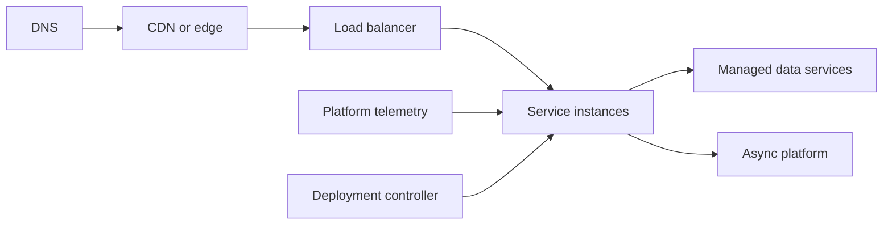

# 08. Cloud and Platform Engineering

Cloud questions test whether a candidate understands the runtime and operational consequences behind managed services, containers, orchestration, networking, autoscaling, and deployments.

## Coverage

- [Platform, containers, scaling, and deployments](platform-and-deployments.md)

## Required artifacts

- Deployment and network-boundary diagram.
- Resource requests/limits and autoscaling signal.
- Availability-zone/region failure strategy.
- Deployment, configuration, secret, and rollback plan.

## Ready when

You can trace a request from DNS to storage, explain container isolation and orchestration, choose scaling signals, and design a safe multi-zone deployment.
