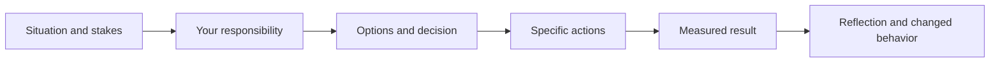

# 09. SDE-2 Leadership and Behavioral Interviews

SDE-2 behavioral evaluation looks for independent ownership, technical judgment, cross-team influence, incident response, mentoring, and measurable delivery rather than abstract leadership claims.

## Coverage

- [Leadership evidence and story bank](leadership-evidence.md)

## Required artifacts

- Six stories covering delivery, conflict, failure, incident, influence, and mentoring.
- A project architecture narrative with decisions and measurable outcomes.
- A failure story showing accountability and durable corrective action.

## Ready when

Stories make individual contribution unambiguous, include alternatives, quantify results, acknowledge mistakes, and show how learning changed later behavior.
