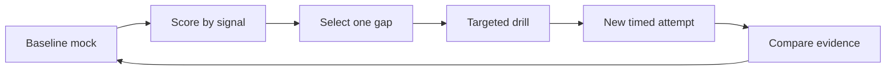

# 10. Practice and Assessment

Preparation becomes interview performance only through timed retrieval, realistic ambiguity, spoken reasoning, and external feedback.

## Coverage

- [Question bank and mock-interview rubric](question-bank-and-rubric.md)

## Minimum interview loop

- Two coding mocks.
- Two LLD mocks with implementation discussion.
- Three HLD mocks across read-heavy, write-heavy, and workflow systems.
- One debugging or incident scenario.
- Two behavioral mocks with follow-up pressure.

## Ready when

Scores are consistently at target across different prompts and interviewers. Any score below target produces a specific drill and a new attempt within one week.
