# SDE-2 Backend Interview Track

This track extends the Java and data-structures volumes into the competencies expected from an SDE-2 backend engineer. It is organized by interview signal rather than technology brand: solve clearly, model maintainable code, design scalable services, reason about failure, and communicate ownership.

!!! info "Curriculum status"
    These pages are structured expansion contracts. Each page defines scope, interview drills, required artifacts, diagrams, and completion criteria so contributors can deepen one topic without fragmenting the learning path.

## Competency map

```mermaid
flowchart LR
    A["Programming and problem solving"] --> B["Low-level design"]
    B --> C["High-level system design"]
    C --> D["API and service design"]
    D --> E["Data and storage"]
    E --> F["Distributed systems"]
    F --> G["Production engineering"]
    G --> H["Cloud and platform"]
    H --> I["Leadership evidence"]
    I --> J["Mock interview loop"]
```

## Ordered modules

| Order | Module | Primary interview signal |
| --- | --- | --- |
| 01 | [Programming problem solving](01-programming-problem-solving/index.md) | Derivation, correctness, complexity, communication |
| 02 | [Low-level design](02-low-level-design/index.md) | Object modeling, SOLID, patterns, extensibility |
| 03 | [High-level system design](03-high-level-system-design/index.md) | Requirements, scale, architecture, trade-offs |
| 04 | [API and service design](04-api-service-design/index.md) | Contracts, reliability semantics, boundaries |
| 05 | [Data and storage](05-data-storage/index.md) | Data models, consistency, indexing, scaling |
| 06 | [Distributed systems](06-distributed-systems/index.md) | Coordination, messaging, failure handling |
| 07 | [Production engineering](07-production-engineering/index.md) | SLOs, observability, testing, security |
| 08 | [Cloud and platform](08-cloud-platform/index.md) | Containers, orchestration, deployment strategy |
| 09 | [Leadership and behavioral](09-leadership-behavioral/index.md) | Ownership, influence, incidents, judgment |
| 10 | [Practice and assessment](10-practice/index.md) | Timed execution, feedback, measurable readiness |

## How to use the track

1. Complete the [readiness matrix](readiness-matrix.md) honestly.
2. Use the [structured revision system](revision-system.md) and [review log](review-log.md) for repeated retrieval.
3. Follow the [12-week roadmap](roadmap.md), or select modules below level 2.
4. Produce the required artifact: code, class diagram, architecture diagram, API contract, data model, runbook, or behavioral story.
5. Explain every decision aloud using constraints, alternatives, failure modes, and operational impact.
6. Re-score after each mock interview and keep an evidence log.

## SDE-2 completion standard

A candidate is ready when they can independently drive an ambiguous problem, state assumptions, produce a correct and testable solution, defend trade-offs, identify failure modes, and connect implementation choices to production outcomes.
