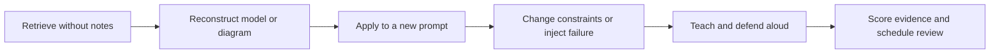

# Structured Revision System

This system is designed for repeated study. It separates recognition from recall and recall from application. Read a page again only after attempting to reconstruct the model without looking.

## Review cadence

| Review | Timing | Required action |
| --- | --- | --- |
| `R0` | Same day | Summarize the model and create the first artifact |
| `R1` | 1 day later | Answer retrieval prompts without notes |
| `R2` | 3 days later | Rebuild the diagram, algorithm, or decision table |
| `R3` | 7 days later | Apply the model to a new interview prompt |
| `R4` | 14 days later | Handle a changed constraint or failure scenario |
| `R5` | 30 days later | Complete a timed mixed-module mock |
| `R6` | 60 days later | Teach the topic and defend follow-up questions |

Missing a review does not reset progress. Resume at the missed stage and shorten the next interval if recall is weak.

## Five-step mastery loop

## One review session

1. `5 min`: blank-page retrieval of terms, invariants, and trade-offs.
2. `10 min`: reconstruct the central diagram or decision framework.
3. `20 min`: solve one focused prompt without references.
4. `10 min`: inject one scale, consistency, security, or failure constraint.
5. `10 min`: explain the result aloud as if answering an interviewer.
6. `5 min`: score evidence and schedule the next review.

## Knowledge states

| State | Evidence | Next action |
| --- | --- | --- |
| Red | Cannot start or explain the core model | Relearn, create a small example, retry tomorrow |
| Amber | Explains basics but misses constraints | Target one gap and retry in three days |
| Green | Applies independently and handles follow-ups | Interleave in a mixed mock within 14 days |
| Durable | Teaches, adapts, and connects to production | Review monthly or after a weak mock |

## Interleaving rules

- Pair coding with LLD, HLD with data, distributed systems with production, and cloud with security.
- Every third session must use an unseen or materially changed prompt.
- Every week must include one timed answer and one teach-back recording.
- Reopen a green topic whenever a mock exposes a concrete missed signal.

Use the [review log](review-log.md) to retain evidence and each module's advanced review page to select drills.
