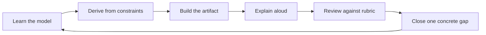

# Backend Interview Roadmap

The roadmap assumes 8-10 focused hours each week. Compress or expand the schedule, but preserve the dependency order: coding fluency before object design, object design before service architecture, and architecture before production operations.

## Twelve-week plan

| Week | Focus | Required evidence |
| --- | --- | --- |
| 1 | Problem framing and complexity | Two narrated coding solutions with explicit invariants |
| 2 | Reusable coding patterns | Pattern decision sheet and six timed problems |
| 3 | LLD modeling and SOLID | Class, sequence, and state diagrams for one case study |
| 4 | LLD patterns and implementation | Runnable core implementation with tests |
| 5 | HLD framework and estimation | One 45-minute system-design recording |
| 6 | Architecture patterns | Two designs with alternatives compared |
| 7 | APIs and service boundaries | OpenAPI-style contract and dependency map |
| 8 | Databases and caching | Data model, index plan, and consistency decision |
| 9 | Distributed systems | Failure matrix for messaging and coordination |
| 10 | Reliability, observability, security | SLO, dashboard, threat model, and runbook |
| 11 | Cloud, deployment, behavioral | Deployment diagram and six calibrated STAR stories |
| 12 | Full interview loop | Coding, LLD, HLD, and behavioral mocks with scores |

## Weekly operating loop

## Daily cadence

- `20 min`: spaced revision of definitions, trade-offs, and failure modes.
- `45 min`: timed problem or design slice.
- `20 min`: explain the solution without notes.
- `15 min`: record mistakes and the next corrective drill.

## Checkpoints

- End of week 4: coding and LLD solutions are executable, not only diagrams.
- End of week 8: HLD answers include estimates, APIs, data, and failure behavior.
- End of week 10: every design has observability, security, and operational ownership.
- End of week 12: no competency in the readiness matrix remains below level 2.
