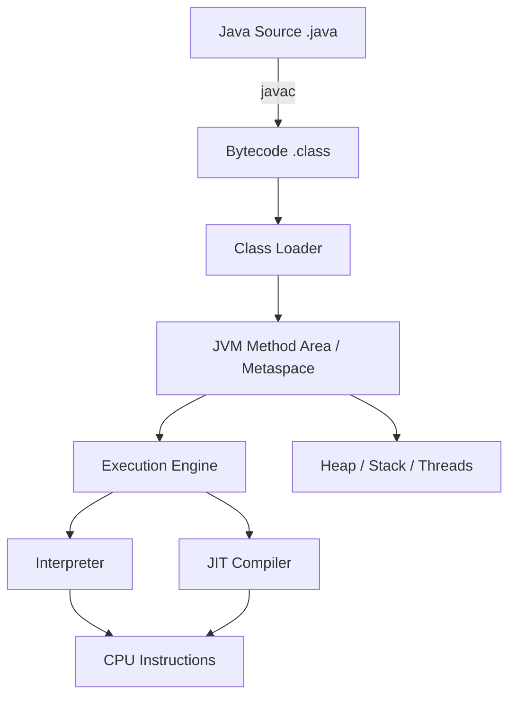

# Chapter 1: Java Ecosystem and Execution Model

## Why This Matters

Senior interviewers check whether you can explain how a Java program moves from source text to CPU instructions. The same answer is used in system design, performance reviews, and debugging stories. Strong candidates describe compile-time, class loading, JIT behavior, and runtime trade-offs without memorizing buzzwords.

## Learning Objectives

- Explain the roles of JDK, JRE, and JVM.
- Trace Java source to bytecode and machine code.
- Contrast interpretation and compilation in Java runtime.
- Discuss JVM warm-up and when performance changes over time.
- Discuss Java versions 8, 11, 17, and 21 at a practical level.

## Core Concept

Java is a high-level language compiled to bytecode. That bytecode runs on a JVM, which behaves as a virtual machine specification implemented by providers (HotSpot, OpenJ9, GraalVM). A JVM provides an execution environment and runtime services like memory management, security, threading, and bytecode execution.

The execution pipeline is typically:

1. **Author writes `.java` code**.
2. **`javac` compiles to `.class` bytecode**.
3. **JVM class loading and linking** prepare metadata.
4. **Runtime executes bytecode** using interpreter/JIT.
5. **JIT compiles hot methods** to native machine code.

## Internal Working

At runtime, the JVM has several independent subsystems: class loading, memory management, execution engine, native interface, and runtime libraries. These subsystems cooperate to convert class files into concrete execution.

## Architecture or Memory Diagram

## Code Example

[Code Example 1 in detail (external file)](https://github.com/vinayreddykalluri/SDE2-Interview-Handbook/blob/master/examples/java/src/main/java/io/github/vinayreddykalluri/interviewhandbook/codingfoundations/javafundamentals/ExecutionDemo.java)

## Step-by-Step Execution

1. `javac` compiles `ExecutionDemo` into `ExecutionDemo.class`.
2. The launcher loads bootstrap classes (`java.lang.String`, `java.lang.System`) and your class.
3. Class loader validates and resolves `sum`, `main`, and constants.
4. JVM starts the `main` method:
   - allocates a stack frame,
   - resolves `System.out` and `println`,
   - executes arithmetic.
5. During repeated calls, `sum` may be interpreted at first and JIT-compiled later.

## Interviewer Perspective

Expect follow-up prompts such as:
- "Why does Java need JVM warm-up?"
- "Why can startup performance and long-run performance differ?"
- "Where do `javac` and `java` differ internally?"

Strong answer pattern: distinguish *compile-time*, *load-time*, and *run-time* phases, then tie to latency/throughput scenarios.

## Common Mistakes

- Treating Java as fully interpreted.
- Assuming JVM is a process manager separate from JVM internals.
- Ignoring warm-up before benchmarking.
- Missing the security and portability value of bytecode.

## Production Perspective

In backend services, Java startup latency matters for serverless and short-lived jobs, while JIT maturity matters for steady-load APIs. JVM tuning and GC/CPU profiling stories should start with this execution model.

## Must Know for DSA

In whiteboard discussions, JVM phases explain why micro-optimizing in Java often requires repeat-run considerations and warm-up. This helps when comparing algorithm complexity against measured timings.

## Interview Questions and Answers

- **Q: What is the role of bytecode?**
  - **Answer:** A portable, platform-neutral intermediate representation.
  - **Follow-up:** "Why does this improve security?" → Bytecode verifier and class loader checks before execution.
- **Q: Why is JVM cold start different from warm performance?**
  - **Answer:** JIT and profile feedback appear after execution.
  - **Follow-up:** "How do you benchmark Java reliably?" → Use warm-up iterations, fixed heap, pinned JVM args.
- **Q: What is the launch sequence for a Java program?**
  - **Answer:** Bootstrap class loader, then platform, then application loader resolve and execute `main`.
  - **Follow-up:** "How can class loading fail?" → CNF/NoClassDefFoundError and classpath/module issues.

## Practice Exercises

1. Draw and explain the full Java execution chain in your own words.
2. List startup events for `public static void main` on a fresh JVM.
3. Run a small benchmark with and without warm-up; observe timing variance.
4. Explain why `javac` failures and runtime failures are often different concerns.
5. Compare Java 8, 11, 17, and 21 defaults that affect runtime behavior.

## Revision Checklist

- [x] Can explain JDK/JRE/JVM distinction in 20 seconds.
- [x] Can trace source -> bytecode -> JIT/native code.
- [x] Can explain warm-up and steady-state.
- [x] Can discuss startup vs throughput tradeoff.

## One-Page Summary

Java is not directly compiled to machine code by default; it is compiled to bytecode and executed by a JVM. Performance emerges from class loading, interpreter fallback, and JIT compilation of hot methods. Understanding these phases is essential for both interview quality answers and production debugging.
