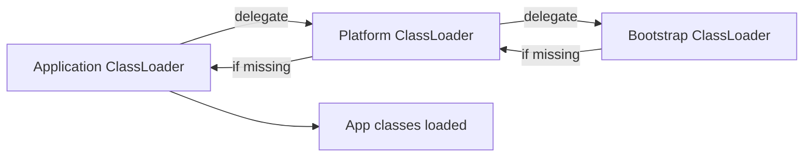

# Chapter 3: Class Loader Subsystem

## Why This Matters

Class loading governs versioning, isolation, and failure modes. Senior interviews often test this through ClassNotFound errors, modular reasoning, and class identity edge cases.

## Learning Objectives

- Name the three standard Java class loaders.
- Explain parent delegation and lifecycle phases.
- Distinguish class loading, linking, verification, and initialization.
- Diagnose common classpath errors.

## Core Concept

Class loading in Java is lazy and hierarchical. The standard model delegates unknown classes upward to parent loaders before the current loader attempts to define it.

## Internal Working

The stages are:

1. **Loading:** locate bytes for class and create class object.
2. **Verification:** check format, constraints, and bytecode safety.
3. **Preparation:** allocate static fields with default values.
4. **Resolution:** constant pool references linked.
5. **Initialization:** run static initializers in dependency order.

## Architecture or Memory Diagram

## Code Example

[Code Example 1 in detail (external file)](https://github.com/vinayreddykalluri/SDE2-Interview-Handbook/blob/master/examples/java/src/main/java/io/github/vinayreddykalluri/interviewhandbook/codingfoundations/javafundamentals/BootDemo.java)

## Step-by-Step Execution

1. Class load request arrives for `BootDemo`.
2. `AppClassLoader` delegates to platform and bootstrap.
3. If unresolved, bootstrap returns null, platform returns null, app attempts own path.
4. On success, class data is verified and prepared.
5. Static initializer executes when class is initialized.

## Interviewer Perspective

Key follow-up: "How does parent delegation reduce security risk?" Answer: it prevents local classes from overriding core APIs.

## Common Mistakes

- Misreading `NoClassDefFoundError` as one single cause.
- Ignoring module boundaries in Java 9+.
- Overusing custom loaders without version control.

## Production Perspective

Class loading issues are common in plugin systems and application servers. Custom loaders can isolate tenant code, but misconfiguration causes class cast and linkage issues.

## Must Know for DSA

No direct algorithmic optimization, but frequently used in design questions around plugin systems and hot deployment.

## Interview Questions and Answers

- **Q: What is parent delegation?**
  - **Answer:** A child loader asks parent first before loading itself.
  - **Follow-up:** "What if a class is missing?" → The request bubbles back to current loader.
- **Q: CNFE vs NoClassDefFoundError?**
  - **Answer:** CNFE at load-time; NoClassDefFoundError often after successful load at compile/link time but failure during later class resolution.
  - **Follow-up:** "Which is easier to debug?" → CNFE with classpath inspection is usually straightforward.

## Practice Exercises

1. Sketch the delegation chain for `java.lang.String`.
2. Force and catch a `NoClassDefFoundError` in an example.
3. Show where static initializer order becomes visible.
4. Discuss where custom class loader is appropriate.

## Revision Checklist

- [x] Can list loader types and order.
- [x] Can describe class loading phases.
- [x] Can explain CNFE vs NoClassDefFoundError.

## One-Page Summary

Class loading is hierarchical and stateful. Parent delegation and phase separation explain most JVM class behavior and most class-related interview failures.
