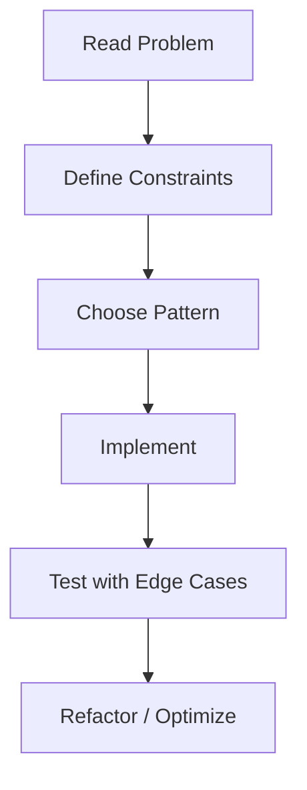

# Chapter 17: Coding Exercises

## Why This Matters

Coding proficiency at interview pace matters more than simply knowing APIs. This chapter contains realistic warm-up tasks directly useful for live coding rounds.

## Learning Objectives

- Practice syntax, branching, loops, and recursion.
- Translate constraints into efficient code.
- Provide polished solutions for at least 30 exercises.

## Core Concept

These exercises force repeated application: define constraints, choose data structures, and reason about edge cases before coding.

## Internal Working

The chapter moves from syntax and loops into arrays, strings, recursion, collections, and debugging patterns. This creates a reusable solving pipeline.

## Architecture or Memory Diagram

## Code Example

[Code Example 1 in detail (external file)](https://github.com/vinayreddykalluri/SDE2-Interview-Handbook/blob/master/examples/java/src/main/java/io/github/vinayreddykalluri/interviewhandbook/codingfoundations/javafundamentals/ExercisePattern.java)

## Step-by-Step Execution

1. Parse statement and identify inputs/outputs.
2. Write base cases and constraints.
3. Build a minimal solution first.
4. Add complexity-aware optimizations.
5. Validate against sample and edge cases.

## Interviewer Perspective

The reviewer is testing coding fluency and problem decomposition. Speak while implementing:
- why this approach,
- why this complexity,
- what risks remain.

## Common Mistakes

- Jumping into code without constraints.
- Ignoring integer overflow and null handling.
- Hardcoding input assumptions.

## Production Perspective

Most production bugs mirror these exercises: unbounded loops, off-by-one, and hidden assumptions with mutable state under load.

## Must Know for DSA

Focus on identifying appropriate complexity class, data movement cost, and memory trade-offs quickly.

## Exercise Format

Each exercise includes statement, example input, expected output, constraints, hint, and target complexity.

## Interview Questions and Answers

- **Interviewer:** Why solve it in two passes?
  - **Response:** One pass for state, one for result if it improves clarity and avoids incorrect state coupling.
- **Interviewer:** How do you verify correctness?
  - **Response:** I use edge cases, invariant checks, and dry runs for boundary values.
- **Interviewer:** What if constraints change?
  - **Response:** Reassess data structure choice and constant factors before rewriting from scratch.

## 1. Syntax and Variables

### Exercise 1: Sum of Two Integers
- **Problem statement:** Return the sum of two integers.
- **Example input:** `a = 7, b = 5`
- **Expected output:** `12`
- **Constraints:** `-10^9 <= a,b <= 10^9`
- **Hint:** Use direct arithmetic.
- **Time complexity target:** O(1)

### Exercise 2: Odd or Even
- **Problem statement:** Determine whether a number is even.
- **Example input:** `10`
- **Expected output:** `true`
- **Constraints:** `Integer range`
- **Hint:** Use modulo.
- **Time complexity target:** O(1)

### Exercise 3: Character Type
- **Problem statement:** Print whether char is digit, letter, or other.
- **Example input:** `'A'`
- **Expected output:** `Letter`
- **Constraints:** Single UTF-16 char.
- **Hint:** Use `Character` methods.
- **Time complexity target:** O(1)

### Exercise 4: Celsius to Fahrenheit
- **Problem statement:** Convert Celsius integer to Fahrenheit.
- **Example input:** `25`
- **Expected output:** `77`
- **Constraints:** `-1000..1000`
- **Hint:** `f = c*9/5+32`.
- **Time complexity target:** O(1)

### Exercise 5: Swap Without Temp
- **Problem statement:** Swap two integers.
- **Example input:** `a=2, b=5`
- **Expected output:** `a=5, b=2`
- **Constraints:** int range.
- **Hint:** Use arithmetic or XOR.
- **Time complexity target:** O(1)

### Exercise 6: Rectangle Area
- **Problem statement:** Compute area of rectangle.
- **Example input:** `l=5, b=4`
- **Expected output:** `20`
- **Constraints:** positive ints.
- **Hint:** Multiply.
- **Time complexity target:** O(1)

### Exercise 7: ASCII Value
- **Problem statement:** Print ASCII/UTF-16 value of a character.
- **Example input:** `A`
- **Expected output:** `65`
- **Constraints:** Character input.
- **Hint:** cast to int.
- **Time complexity target:** O(1)

### Exercise 8: Simple Age Bracket
- **Problem statement:** Print age category.
- **Example input:** `28`
- **Expected output:** `Adult`
- **Constraints:** `0..120`
- **Hint:** chain `if` conditions.
- **Time complexity target:** O(1)

### Exercise 9: Minutes to Hours
- **Problem statement:** Convert total minutes to hours and minutes.
- **Example input:** `130`
- **Expected output:** `2 h 10 m`
- **Constraints:** non-negative.
- **Hint:** division and remainder.
- **Time complexity target:** O(1)

### Exercise 10: Days in Month
- **Problem statement:** Print days in month for given month and year.
- **Example input:** `2, 2024`
- **Expected output:** `29`
- **Constraints:** Gregorian calendar assumptions.
- **Hint:** use array or switch and leap check.
- **Time complexity target:** O(1)

## 2. Conditionals

### Exercise 11: Maximum of Three
- **Problem statement:** Return max among three numbers.
- **Example input:** `10, 2, 18`
- **Expected output:** `18`
- **Constraints:** ints.
- **Hint:** chain comparisons.
- **Time complexity target:** O(1)

### Exercise 12: Grade Classifier
- **Problem statement:** Map score to grade.
- **Example input:** `88`
- **Expected output:** `B`
- **Constraints:** `0..100`
- **Hint:** if-else range checks.
- **Time complexity target:** O(1)

### Exercise 13: Leap Year
- **Problem statement:** Check leap year.
- **Example input:** `2000`
- **Expected output:** `true`
- **Constraints:** positive year.
- **Hint:** `%400` and `%100` rules.
- **Time complexity target:** O(1)

### Exercise 14: Triangle Type
- **Problem statement:** Identify triangle type.
- **Example input:** `3 4 5`
- **Expected output:** `scalene`
- **Constraints:** positive int sides.
- **Hint:** compare equality conditions.
- **Time complexity target:** O(1)

### Exercise 15: Login Attempts
- **Problem statement:** Count allowed attempts and return lock status.
- **Example input:** `failedAttempts=5`
- **Expected output:** `LOCKED`
- **Constraints:** small ints.
- **Hint:** simple threshold.
- **Time complexity target:** O(1)

### Exercise 16: Discount Slab
- **Problem statement:** Compute discount by amount range.
- **Example input:** `5600`
- **Expected output:** `10`
- **Constraints:** positive number.
- **Hint:** conditions on ranges.
- **Time complexity target:** O(1)

### Exercise 17: ATM Withdrawal
- **Problem statement:** Validate denomination support.
- **Example input:** `230`
- **Expected output:** `false`
- **Constraints:** note set [10,20,50,100,500,2000]
- **Hint:** check divisibility.
- **Time complexity target:** O(1)

### Exercise 18: Password Policy
- **Problem statement:** Check length and digit presence.
- **Example input:** `P@ss123`
- **Expected output:** `valid`
- **Constraints:** length <= 64.
- **Hint:** iterate chars.
- **Time complexity target:** O(n)

### Exercise 19: Largest Magnitude
- **Problem statement:** find number with largest absolute value.
- **Example input:** `-5, 3`
- **Expected output:** `-5`
- **Constraints:** ints.
- **Hint:** `Math.abs` with care.
- **Time complexity target:** O(1)

### Exercise 20: Vowel Check
- **Problem statement:** Return whether character is vowel.
- **Example input:** `o`
- **Expected output:** `true`
- **Constraints:** lowercase letters.
- **Hint:** switch over vowels.
- **Time complexity target:** O(1)

## 3. Loops

### Exercise 21: Print N numbers
- **Problem statement:** Print first n natural numbers.
- **Example input:** `5`
- **Expected output:** `1 2 3 4 5`
- **Constraints:** `n >= 1`
- **Hint:** for-loop.
- **Time complexity target:** O(n)

### Exercise 22: Factorial
- **Problem statement:** Compute n!.
- **Example input:** `5`
- **Expected output:** `120`
- **Constraints:** n <= 20
- **Hint:** multiply iteratively.
- **Time complexity target:** O(n)

### Exercise 23: Count digits
- **Problem statement:** Count digits in integer.
- **Example input:** `1453`
- **Expected output:** `4`
- **Constraints:** positive.
- **Hint:** divide by 10 loop.
- **Time complexity target:** O(log n)

### Exercise 24: Reverse Number
- **Problem statement:** Reverse integer digits.
- **Example input:** `1234`
- **Expected output:** `4321`
- **Constraints:** handle negatives and overflow loosely.
- **Hint:** modulo arithmetic.
- **Time complexity target:** O(log n)

### Exercise 25: GCD
- **Problem statement:** Compute GCD of two numbers.
- **Example input:** `54, 24`
- **Expected output:** `6`
- **Constraints:** positive ints.
- **Hint:** Euclidean algorithm.
- **Time complexity target:** O(log n)

### Exercise 26: Fibonacci Series
- **Problem statement:** Print first n Fibonacci numbers.
- **Example input:** `6`
- **Expected output:** `0 1 1 2 3 5`
- **Constraints:** n <= 46
- **Hint:** maintain two previous values.
- **Time complexity target:** O(n)

### Exercise 27: Prime Count
- **Problem statement:** Count primes <= n.
- **Example input:** `10`
- **Expected output:** `4`
- **Constraints:** n <= 1e5
- **Hint:** trial division.
- **Time complexity target:** O(n log log n) for optimized.

### Exercise 28: Star Pattern
- **Problem statement:** Print a square star pattern size n.
- **Example input:** `3`
- **Expected output:**
`***\n***\n***`
- **Constraints:** `n>0`
- **Hint:** nested loops.
- **Time complexity target:** O(n^2)

### Exercise 29: Power of Two
- **Problem statement:** Check if n is power of two.
- **Example input:** `16`
- **Expected output:** `true`
- **Constraints:** int positive.
- **Hint:** bit trick or loop.
- **Time complexity target:** O(1)

### Exercise 30: Odd Number Printer
- **Problem statement:** Print first n odd numbers.
- **Example input:** `4`
- **Expected output:** `1 3 5 7`
- **Constraints:** n>0
- **Hint:** step of 2.
- **Time complexity target:** O(n)

## 4. Methods

### Exercise 31: Is Prime
- **Problem statement:** Return whether input is prime.
- **Example input:** `13`
- **Expected output:** `true`
- **Constraints:** `n <= 1e7`
- **Hint:** check divisibility to sqrt(n).
- **Time complexity target:** O(sqrt n)

### Exercise 32: LCM
- **Problem statement:** Compute LCM of two numbers.
- **Example input:** `4, 6`
- **Expected output:** `12`
- **Constraints:** positive ints.
- **Hint:** lcm(a,b)=a*b/gcd(a,b).
- **Time complexity target:** O(log n)

### Exercise 33: Pow Mod
- **Problem statement:** Implement modular exponent.
- **Example input:** `2^10 mod 1000`
- **Expected output:** `24`
- **Constraints:** base and exp positive.
- **Hint:** fast exponentiation.
- **Time complexity target:** O(log n)

### Exercise 34: Reverse String
- **Problem statement:** Reverse a string by method.
- **Example input:** `cat`
- **Expected output:** `tac`
- **Constraints:** non-null.
- **Hint:** two-pointer.
- **Time complexity target:** O(n)

### Exercise 35: Count Vowels
- **Problem statement:** count vowels in string.
- **Example input:** `interview`
- **Expected output:** `3`
- **Constraints:** lowercase.
- **Hint:** iterate.
- **Time complexity target:** O(n)

## 5. Arrays

### Exercise 36: Max Subarray Sum Simple
- **Problem statement:** Find max element in array.
- **Example input:** `[1,5,2]`
- **Expected output:** `5`
- **Constraints:** non-empty.
- **Hint:** linear scan.
- **Time complexity target:** O(n)

### Exercise 37: Find Element
- **Problem statement:** Linear search target.
- **Example input:** `[1,3,5], 3`
- **Expected output:** `1`
- **Constraints:** 0-indexed.
- **Hint:** scan each index.
- **Time complexity target:** O(n)

### Exercise 38: Rotate by One
- **Problem statement:** Rotate array right by one.
- **Example input:** `[1,2,3]`
- **Expected output:** `[3,1,2]`
- **Constraints:** non-empty.
- **Hint:** store last element.
- **Time complexity target:** O(n)

### Exercise 39: Merge Two Arrays
- **Problem statement:** Merge sorted arrays.
- **Example input:** `[1,3]`, `[2,4]`
- **Expected output:** `[1,2,3,4]`
- **Constraints:** sorted ascending.
- **Hint:** two pointers.
- **Time complexity target:** O(n+m)

### Exercise 40: Remove Duplicates
- **Problem statement:** Remove duplicates in sorted array in-place.
- **Example input:** `[1,1,2]`
- **Expected output:** `2, [1,2]`
- **Constraints:** sorted.
- **Hint:** two-pointer.
- **Time complexity target:** O(n)

### Exercise 41: Reverse Array
- **Problem statement:** Reverse array in place.
- **Example input:** `[1,2,3]`
- **Expected output:** `[3,2,1]`
- **Constraints:** non-empty.
- **Hint:** swap ends.
- **Time complexity target:** O(n)

### Exercise 42: Prefix Sums
- **Problem statement:** Build prefix sum array.
- **Example input:** `[1,2,3]`
- **Expected output:** `[1,3,6]`
- **Constraints:** int values.
- **Hint:** cumulative total.
- **Time complexity target:** O(n)

### Exercise 43: Missing Number
- **Problem statement:** Find missing number from 0..n.
- **Example input:** `[0,1,3]`
- **Expected output:** `2`
- **Constraints:** one missing.
- **Hint:** xor or sum.
- **Time complexity target:** O(n)

### Exercise 44: Two Sum
- **Problem statement:** Return indices with given sum.
- **Example input:** `[2,7,11,15], k=9`
- **Expected output:** `[0,1]`
- **Constraints:** one valid pair.
- **Hint:** hashmap.
- **Time complexity target:** O(n)

### Exercise 45: Product Except Self Intro
- **Problem statement:** Return array where each index is product excluding itself.
- **Example input:** `[1,2,3,4]`
- **Expected output:** `[24,12,8,6]`
- **Constraints:** use O(1) extra where possible.
- **Hint:** prefix and suffix products.
- **Time complexity target:** O(n)

## 6. Strings

### Exercise 46: Palindrome
- **Problem statement:** Check palindrome string.
- **Example input:** `madam`
- **Expected output:** `true`
- **Constraints:** ASCII letters.
- **Hint:** two-pointer.
- **Time complexity target:** O(n)

### Exercise 47: Reverse Words
- **Problem statement:** Reverse words in sentence.
- **Example input:** `hello world`
- **Expected output:** `world hello`
- **Constraints:** multiple spaces.
- **Hint:** split and reverse.
- **Time complexity target:** O(n)

### Exercise 48: Longest Substring Without Repeat
- **Problem statement:** Longest substring length without repeated chars.
- **Example input:** `abcabcbb`
- **Expected output:** `3`
- **Constraints:** length <= 50000
- **Hint:** sliding window.
- **Time complexity target:** O(n)

### Exercise 49: Count Words
- **Problem statement:** Count words in sentence.
- **Example input:** `a bc`
- **Expected output:** `2`
- **Constraints:** trim spaces.
- **Hint:** state machine.
- **Time complexity target:** O(n)

### Exercise 50: String Rotation
- **Problem statement:** Check if s2 is rotation of s1.
- **Example input:** `water`, `erwat`
- **Expected output:** `true`
- **Constraints:** equal length.
- **Hint:** concatenation contains.
- **Time complexity target:** O(n)

### Exercise 51: Roman to Int
- **Problem statement:** Convert Roman numeral to integer.
- **Example input:** `MCMIV`
- **Expected output:** `1904`
- **Constraints:** valid numerals.
- **Hint:** mapping with subtractive cases.
- **Time complexity target:** O(n)

### Exercise 52: Valid Parentheses
- **Problem statement:** validate parentheses.
- **Example input:** `()[]{}
`
- **Expected output:** `true`
- **Constraints:** string length <= 1e5
- **Hint:** use stack.
- **Time complexity target:** O(n)

### Exercise 53: Longest Common Prefix
- **Problem statement:** Find common prefix among strings.
- **Example input:** `["flower","flow","flight"]`
- **Expected output:** `fl`
- **Constraints:** 1..200 strings.
- **Hint:** compare with first element.
- **Time complexity target:** O(n*m)

### Exercise 54: Reverse String Builder
- **Problem statement:** Build reverse by API.
- **Example input:** `java`
- **Expected output:** `avaj`
- **Constraints:** non-null.
- **Hint:** `StringBuilder` reverse.
- **Time complexity target:** O(n)

### Exercise 55: Find Anagram
- **Problem statement:** Determine anagram pair.
- **Example input:** `listen`, `silent`
- **Expected output:** `true`
- **Constraints:** lowercase alphabets.
- **Hint:** character frequency.
- **Time complexity target:** O(n)

### Exercise 56: Remove Vowels
- **Problem statement:** Remove vowels from string.
- **Example input:** `interview`
- **Expected output:** `ntrvw`
- **Constraints:** ascii lowercase.
- **Hint:** build with predicate.
- **Time complexity target:** O(n)

### Exercise 57: String Compression
- **Problem statement:** Run-length compress.
- **Example input:** `aaabbc`
- **Expected output:** `a3b2c1`
- **Constraints:** lower case.
- **Hint:** count consecutive chars.
- **Time complexity target:** O(n)

### Exercise 58: Is Subsequence
- **Problem statement:** Check if s is subsequence of t.
- **Example input:** `abc`, `ahbgdc`
- **Expected output:** `true`
- **Constraints:** length <= 10000
- **Hint:** two pointers.
- **Time complexity target:** O(n)

### Exercise 59: First Non-Repeating Character
- **Problem statement:** return first non-repeating char.
- **Example input:** `leetcode`
- **Expected output:** `l`
- **Constraints:** lowercase.
- **Hint:** frequency then first index.
- **Time complexity target:** O(n)

### Exercise 60: Encode/Decode String
- **Problem statement:** encode repeated chars with counts.
- **Example input:** `aabccc`
- **Expected output:** `a2b1c3`
- **Constraints:** only letters.
- **Hint:** two-pass builder.
- **Time complexity target:** O(n)

## 7. Math

### Exercise 61: Reverse Integer
- **Problem statement:** Reverse int with overflow check.
- **Example input:** `123`
- **Expected output:** `321`
- **Constraints:** 32-bit int.
- **Hint:** use long to check limits.
- **Time complexity target:** O(log n)

### Exercise 62: Power Check
- **Problem statement:** Check if n is power of three.
- **Example input:** `27`
- **Expected output:** `true`
- **Constraints:** n > 0
- **Hint:** divide by 3 loop.
- **Time complexity target:** O(log_3 n)

### Exercise 63: Square Root
- **Problem statement:** Integer floor sqrt.
- **Example input:** `10`
- **Expected output:** `3`
- **Constraints:** n>=0
- **Hint:** binary search.
- **Time complexity target:** O(log n)

### Exercise 64: Perfect Number
- **Problem statement:** Check perfect number.
- **Example input:** `28`
- **Expected output:** `true`
- **Constraints:** up to 1e6
- **Hint:** factor sum.
- **Time complexity target:** O(sqrt n)

### Exercise 65: Nth Digit
- **Problem statement:** Find nth digit in 1... sequence.
- **Example input:** `11`
- **Expected output:** `0`
- **Constraints:** n >= 1
- **Hint:** iterate groups by digits.
- **Time complexity target:** O(log n)

### Exercise 66: Roman to Int
- **Problem statement:** Convert Roman again with edge map.
- **Example input:** `XLIX`
- **Expected output:** `49`
- **Constraints:** valid symbols.
- **Hint:** subtractive pairs.
- **Time complexity target:** O(n)

### Exercise 67: Palindromic Number
- **Problem statement:** Number palindrome without conversion.
- **Example input:** `1221`
- **Expected output:** `true`
- **Constraints:** non-negative.
- **Hint:** reverse half number.
- **Time complexity target:** O(log n)

### Exercise 68: Add Digits
- **Problem statement:** repeatedly sum digits to one digit.
- **Example input:** `38`
- **Expected output:** `2`
- **Constraints:** n positive.
- **Hint:** digital root formula optional.
- **Time complexity target:** O(log n)

## 8. Recursion Basics

### Exercise 69: Sum of Array via Recursion
- **Problem statement:** Sum elements recursively.
- **Example input:** `[1,2,3]`
- **Expected output:** `6`
- **Constraints:** non-empty.
- **Hint:** index-based recursion.
- **Time complexity target:** O(n)

### Exercise 70: Binary Search Recursive
- **Problem statement:** Recursive binary search index.
- **Example input:** `[1,2,3,4]`, target 3
- **Expected output:** `2`
- **Constraints:** sorted array.
- **Hint:** shrink bounds.
- **Time complexity target:** O(log n)

### Exercise 71: Print Subsets
- **Problem statement:** Generate all subsets.
- **Example input:** `[1,2]`
- **Expected output:** `[[],[1],[2],[1,2]]`
- **Constraints:** n<=10
- **Hint:** include/exclude recursion.
- **Time complexity target:** O(2^n)

### Exercise 72: Permutations
- **Problem statement:** Print permutations.
- **Example input:** `[1,2,3]`
- **Expected output:** `6 permutations`
- **Constraints:** n<=9
- **Hint:** backtracking.
- **Time complexity target:** O(n!)

### Exercise 73: Tower of Hanoi
- **Problem statement:** return count minimum moves.
- **Example input:** `2`
- **Expected output:** `3`
- **Constraints:** n<=20
- **Hint:** recurrence 2^n-1.
- **Time complexity target:** O(1)

### Exercise 74: Recursion to Print Pattern
- **Problem statement:** print numeric triangle using recursion.
- **Example input:** `3`
- **Expected output:** `1\n12\n123`
- **Constraints:** small n
- **Hint:** recursive rows.
- **Time complexity target:** O(n^2)

### Exercise 75: Combination Sum Intro
- **Problem statement:** count combinations to target.
- **Example input:** `combos [2,3,5], target=8`
- **Expected output:** count >0
- **Constraints:** positives
- **Hint:** recursion/backtracking with pruning.
- **Time complexity target:** exponential

## 9. Collections Basics

### Exercise 76: Frequency Map
- **Problem statement:** Count character frequencies.
- **Example input:** `abbccc`
- **Expected output:** `a1 b2 c3`
- **Constraints:** lowercase.
- **Hint:** HashMap.
- **Time complexity target:** O(n)

### Exercise 77: First Unique Element
- **Problem statement:** return first unique integer.
- **Example input:** `[4,1,2,1,4]`
- **Expected output:** `2`
- **Constraints:** int values.
- **Hint:** count map then scan.
- **Time complexity target:** O(n)

### Exercise 78: Merge Sorted Maps
- **Problem statement:** Merge two key-count maps.
- **Example input:** `{a:1}`, `{a:2,b:1}`
- **Expected output:** `{a:3,b:1}`
- **Constraints:** string keys.
- **Hint:** map merge.
- **Time complexity target:** O(n+m)

### Exercise 79: Remove Duplicates from String List
- **Problem statement:** Return ordered unique list.
- **Example input:** `[a,a,b,c,b]`
- **Expected output:** `[a,b,c]`
- **Constraints:** preserve first appearance.
- **Hint:** LinkedHashSet.
- **Time complexity target:** O(n)

### Exercise 80: Min Stack
- **Problem statement:** Design min stack.
- **Example input:** push 5,3,7; getMin
- **Expected output:** `3`
- **Constraints:** O(1) stack ops.
- **Hint:** auxiliary stack.
- **Time complexity target:** O(1)

### Exercise 81: Queue using Two Stacks
- **Problem statement:** Implement queue operations.
- **Example input:** enqueue/dequeue sequence
- **Expected output:** correct FIFO behavior
- **Constraints:** amortized analysis.
- **Hint:** input/output stacks.
- **Time complexity target:** amortized O(1)

### Exercise 82: LRU Cache Intro
- **Problem statement:** get/put with recency order.
- **Example input:** capacity=2
- **Expected output:** operations match LRU.
- **Constraints:** O(1) target.
- **Hint:** HashMap + Doubly linked list.
- **Time complexity target:** O(1)

### Exercise 83: Top K Frequent
- **Problem statement:** return k most frequent elements.
- **Example input:** `[1,1,1,2,2,3], k=2`
- **Expected output:** `[1,2]`
- **Constraints:** k <= unique.
- **Hint:** hashmap + bucket.
- **Time complexity target:** O(n log n)

### Exercise 84: Group Anagrams
- **Problem statement:** group strings with same letters.
- **Example input:** `[eat, tea, tan, ate, nat, bat]`
- **Expected output:** `[[eat,tea,ate],[tan,nat],[bat]]`
- **Constraints:** lowercase.
- **Hint:** sort each word as key.
- **Time complexity target:** O(n * k log k)

### Exercise 85: Valid Anagram
- **Problem statement:** determine if two strings are anagrams.
- **Example input:** `anagram, nag a ram`
- **Expected output:** true
- **Constraints:** ascii
- **Hint:** normalize and count.
- **Time complexity target:** O(n)

### Exercise 86: Design HashSet with Remove
- **Problem statement:** implement set with add/remove/contains.
- **Example input:** add1,add2,remove1
- **Expected output:** set operations.
- **Constraints:** no duplicates.
- **Hint:** linked hash map boolean.
- **Time complexity target:** O(1)

## 10. Debugging Exercises

### Exercise 87: Fix NPE in Collection Loop
- **Problem statement:** Given null list, make method safe.
- **Example input:** null
- **Expected output:** no exception, return 0
- **Constraints:** defensive coding.
- **Hint:** null checks and early return.
- **Time complexity target:** O(1)

### Exercise 88: Off-by-One in Loop
- **Problem statement:** Fix one-element skip bug.
- **Example input:** `[1,2,3]`
- **Expected output:** 6
- **Constraints:** sum all elements.
- **Hint:** adjust length boundaries.
- **Time complexity target:** O(n)

### Exercise 89: Mutable Shared State
- **Problem statement:** Diagnose bug from shared list in multi-thread.
- **Example input:** two threads add concurrently.
- **Expected output:** deterministic size if expected.
- **Constraints:** thread-safe solution.
- **Hint:** synchronization or concurrent structures.
- **Time complexity target:** O(n)

### Exercise 90: String Immutable Trap
- **Problem statement:** avoid repeated concatenation in loop.
- **Example input:** 10000 concatenations
- **Expected output:** fast execution
- **Hint:** StringBuilder.
- **Time complexity target:** O(n)

### Exercise 91: Leaking Stream
- **Problem statement:** Stream not consumed due to no terminal operation.
- **Example input:** filter only
- **Expected output:** explanation and fix.
- **Constraints:** stream semantics.
- **Hint:** add collect/forEach.
- **Time complexity target:** O(n)

### Exercise 92: Recursion Stack Exhaustion
- **Problem statement:** detect non-terminating recursion.
- **Example input:** bad base case.
- **Expected output:** base case proposal.
- **Constraints:** minimal fix.
- **Hint:** add termination condition.
- **Time complexity target:** O(1)

### Exercise 93: Integer Division Bug
- **Problem statement:** avoid precision loss for average.
- **Example input:** `sum=5, count=2`
- **Expected output:** `2.5`
- **Constraints:** doubles.
- **Hint:** cast one operand.
- **Time complexity target:** O(1)

### Exercise 94: Null Map Key
- **Problem statement:** avoid NPE in map merge.
- **Example input:** map with null value.
- **Expected output:** safe retrieval.
- **Constraints:** robust API.
- **Hint:** handle `null` default.
- **Time complexity target:** O(1)

### Exercise 95: Wrong Comparator
- **Problem statement:** fix comparator causing ClassCastException.
- **Example input:** mixed nulls and values.
- **Expected output:** stable sorted output.
- **Constraints:** comparator contract.
- **Hint:** Comparator.nullsFirst.
- **Time complexity target:** O(n log n)

### Exercise 96: BigInteger in loops
- **Problem statement:** replace excessive BigInteger for performance.
- **Example input:** large but bounded increments.
- **Expected output:** primitive replacement.
- **Constraints:** exactness not required.
- **Hint:** use long.
- **Time complexity target:** O(1)

### Exercise 97: GC Pressure
- **Problem statement:** identify and reduce object churn in loop.
- **Example input:** repeated allocation.
- **Expected output:** improved allocations.
- **Constraints:** 1M iterations.
- **Hint:** reuse buffers.
- **Time complexity target:** O(n)

### Exercise 98: Time Complexity Mislabel
- **Problem statement:** fix claimed complexity from nested loop.
- **Example input:** nested dependent loops.
- **Expected output:** correct complexity.
- **Constraints:** reasoning only.
- **Hint:** calculate loop bounds.
- **Time complexity target:** O(n^2)

### Exercise 99: Concurrent Modification
- **Problem statement:** fix fail-fast crash in iteration.
- **Example input:** for-each with remove.
- **Expected output:** safe iteration.
- **Constraints:** choose Iterator or collect to remove.
- **Hint:** iterator.remove.
- **Time complexity target:** O(n)

### Exercise 100: Interview Whiteboard Simulation
- **Problem statement:** solve `twoSum` under 20 lines.
- **Example input:** `[3,3],6`
- **Expected output:** `[0,1]`
- **Constraints:** one valid answer.
- **Hint:** map first.
- **Time complexity target:** O(n)

## Solutions (first 30 problems)

### Solution 1: Sum of Two Integers
[Code Example 2 in detail (external file)](https://github.com/vinayreddykalluri/SDE2-Interview-Handbook/blob/master/examples/java/src/main/java/io/github/vinayreddykalluri/interviewhandbook/codingfoundations/javafundamentals/SumNumbers.java)

### Solution 2: Odd or Even
[Code Example 3 in detail (external file)](https://github.com/vinayreddykalluri/SDE2-Interview-Handbook/blob/master/examples/java/src/main/java/io/github/vinayreddykalluri/interviewhandbook/codingfoundations/javafundamentals/EvenNumberCheck.java)

### Solution 3: Character Type
[Code Example 4 in detail (external file)](https://github.com/vinayreddykalluri/SDE2-Interview-Handbook/blob/master/examples/java/src/main/java/io/github/vinayreddykalluri/interviewhandbook/codingfoundations/javafundamentals/CharacterType.java)

### Solution 4: Celsius to Fahrenheit
[Code Example 5 in detail (external file)](https://github.com/vinayreddykalluri/SDE2-Interview-Handbook/blob/master/examples/java/src/main/java/io/github/vinayreddykalluri/interviewhandbook/codingfoundations/javafundamentals/TemperatureConversion.java)

### Solution 5: Swap Without Temp
[Code Example 6 in detail (external file)](https://github.com/vinayreddykalluri/SDE2-Interview-Handbook/blob/master/examples/java/src/main/java/io/github/vinayreddykalluri/interviewhandbook/codingfoundations/javafundamentals/ArrayValueSwap.java)

### Solution 6: Rectangle Area
[Code Example 7 in detail (external file)](https://github.com/vinayreddykalluri/SDE2-Interview-Handbook/blob/master/examples/java/src/main/java/io/github/vinayreddykalluri/interviewhandbook/codingfoundations/javafundamentals/RectangleArea.java)

### Solution 7: ASCII Value
[Code Example 8 in detail (external file)](https://github.com/vinayreddykalluri/SDE2-Interview-Handbook/blob/master/examples/java/src/main/java/io/github/vinayreddykalluri/interviewhandbook/codingfoundations/javafundamentals/CharacterCode.java)

### Solution 8: Age Bracket
[Code Example 9 in detail (external file)](https://github.com/vinayreddykalluri/SDE2-Interview-Handbook/blob/master/examples/java/src/main/java/io/github/vinayreddykalluri/interviewhandbook/codingfoundations/javafundamentals/AgeBracket.java)

### Solution 9: Minutes to Hours
[Code Example 10 in detail (external file)](https://github.com/vinayreddykalluri/SDE2-Interview-Handbook/blob/master/examples/java/src/main/java/io/github/vinayreddykalluri/interviewhandbook/codingfoundations/javafundamentals/MinutesToHours.java)

### Solution 10: Days in Month
[Code Example 11 in detail (external file)](https://github.com/vinayreddykalluri/SDE2-Interview-Handbook/blob/master/examples/java/src/main/java/io/github/vinayreddykalluri/interviewhandbook/codingfoundations/javafundamentals/DaysInMonth.java)

### Solution 11: Maximum of Three
[Code Example 12 in detail (external file)](https://github.com/vinayreddykalluri/SDE2-Interview-Handbook/blob/master/examples/java/src/main/java/io/github/vinayreddykalluri/interviewhandbook/codingfoundations/javafundamentals/MaximumOfThree.java)

### Solution 12: Grade Classifier
[Code Example 13 in detail (external file)](https://github.com/vinayreddykalluri/SDE2-Interview-Handbook/blob/master/examples/java/src/main/java/io/github/vinayreddykalluri/interviewhandbook/codingfoundations/javafundamentals/GradeCalculator.java)

### Solution 13: Leap Year
[Code Example 14 in detail (external file)](https://github.com/vinayreddykalluri/SDE2-Interview-Handbook/blob/master/examples/java/src/main/java/io/github/vinayreddykalluri/interviewhandbook/codingfoundations/javafundamentals/LeapYearCheck.java)

### Solution 14: Triangle Type
[Code Example 15 in detail (external file)](https://github.com/vinayreddykalluri/SDE2-Interview-Handbook/blob/master/examples/java/src/main/java/io/github/vinayreddykalluri/interviewhandbook/codingfoundations/javafundamentals/TriangleClassification.java)

### Solution 15: Login Attempts
[Code Example 16 in detail (external file)](https://github.com/vinayreddykalluri/SDE2-Interview-Handbook/blob/master/examples/java/src/main/java/io/github/vinayreddykalluri/interviewhandbook/codingfoundations/javafundamentals/AccountLockStatus.java)

### Solution 16: Discount Slab
[Code Example 17 in detail (external file)](https://github.com/vinayreddykalluri/SDE2-Interview-Handbook/blob/master/examples/java/src/main/java/io/github/vinayreddykalluri/interviewhandbook/codingfoundations/javafundamentals/DiscountRate.java)

### Solution 17: ATM Withdrawal
[Code Example 18 in detail (external file)](https://github.com/vinayreddykalluri/SDE2-Interview-Handbook/blob/master/examples/java/src/main/java/io/github/vinayreddykalluri/interviewhandbook/codingfoundations/javafundamentals/AtmAmountValidation.java)

### Solution 18: Password Policy
[Code Example 19 in detail (external file)](https://github.com/vinayreddykalluri/SDE2-Interview-Handbook/blob/master/examples/java/src/main/java/io/github/vinayreddykalluri/interviewhandbook/codingfoundations/javafundamentals/PasswordValidation.java)

### Solution 19: Largest Magnitude
[Code Example 20 in detail (external file)](https://github.com/vinayreddykalluri/SDE2-Interview-Handbook/blob/master/examples/java/src/main/java/io/github/vinayreddykalluri/interviewhandbook/codingfoundations/javafundamentals/AbsoluteMaximum.java)

### Solution 20: Vowel Check
[Code Example 21 in detail (external file)](https://github.com/vinayreddykalluri/SDE2-Interview-Handbook/blob/master/examples/java/src/main/java/io/github/vinayreddykalluri/interviewhandbook/codingfoundations/javafundamentals/VowelCheck.java)

### Solution 21: Print N numbers
[Code Example 22 in detail (external file)](https://github.com/vinayreddykalluri/SDE2-Interview-Handbook/blob/master/examples/java/src/main/java/io/github/vinayreddykalluri/interviewhandbook/codingfoundations/javafundamentals/PrintOneToN.java)

### Solution 22: Factorial
[Code Example 23 in detail (external file)](https://github.com/vinayreddykalluri/SDE2-Interview-Handbook/blob/master/examples/java/src/main/java/io/github/vinayreddykalluri/interviewhandbook/codingfoundations/javafundamentals/Factorial.java)

### Solution 23: Count Digits
[Code Example 24 in detail (external file)](https://github.com/vinayreddykalluri/SDE2-Interview-Handbook/blob/master/examples/java/src/main/java/io/github/vinayreddykalluri/interviewhandbook/codingfoundations/javafundamentals/DigitCount.java)

### Solution 24: Reverse Number
[Code Example 25 in detail (external file)](https://github.com/vinayreddykalluri/SDE2-Interview-Handbook/blob/master/examples/java/src/main/java/io/github/vinayreddykalluri/interviewhandbook/codingfoundations/javafundamentals/ReverseInteger.java)

### Solution 25: GCD
[Code Example 26 in detail (external file)](https://github.com/vinayreddykalluri/SDE2-Interview-Handbook/blob/master/examples/java/src/main/java/io/github/vinayreddykalluri/interviewhandbook/codingfoundations/javafundamentals/GreatestCommonDivisor.java)

### Solution 26: Fibonacci Series
[Code Example 27 in detail (external file)](https://github.com/vinayreddykalluri/SDE2-Interview-Handbook/blob/master/examples/java/src/main/java/io/github/vinayreddykalluri/interviewhandbook/codingfoundations/javafundamentals/FibonacciSequence.java)

### Solution 27: Prime Count
[Code Example 28 in detail (external file)](https://github.com/vinayreddykalluri/SDE2-Interview-Handbook/blob/master/examples/java/src/main/java/io/github/vinayreddykalluri/interviewhandbook/codingfoundations/javafundamentals/PrimeCount.java)

### Solution 28: Star Pattern
[Code Example 29 in detail (external file)](https://github.com/vinayreddykalluri/SDE2-Interview-Handbook/blob/master/examples/java/src/main/java/io/github/vinayreddykalluri/interviewhandbook/codingfoundations/javafundamentals/SquarePattern.java)

### Solution 29: Power of Two
[Code Example 30 in detail (external file)](https://github.com/vinayreddykalluri/SDE2-Interview-Handbook/blob/master/examples/java/src/main/java/io/github/vinayreddykalluri/interviewhandbook/codingfoundations/javafundamentals/PowerOfTwoCheck.java)

### Solution 30: Odd Number Printer
[Code Example 31 in detail (external file)](https://github.com/vinayreddykalluri/SDE2-Interview-Handbook/blob/master/examples/java/src/main/java/io/github/vinayreddykalluri/interviewhandbook/codingfoundations/javafundamentals/PrintOddNumbers.java)

## Practice Exercises

### Core practice set

1. Solve three questions from each section in under 15 minutes.
2. Re-run the same question with reversed constraints and observe complexity impact.
3. Compare your solution against a two-approach alternative (bruteforce + optimized).

## Revision Checklist

- [ ] Implement every exercise without external help.
- [ ] Solve all 30 solution problems from memory.
- [ ] Re-run solutions with edge cases.
- [ ] Time your solutions under one minute each.
- [ ] Explain approaches verbally before coding.

## One-Page Summary

Use repeated execution cycles: understand, implement, validate, optimize, summarize.

These exercises build coding speed, correctness habits, and interview communication. Complete them in repeated cycles: concept pass, implementation pass, edge-case pass.
