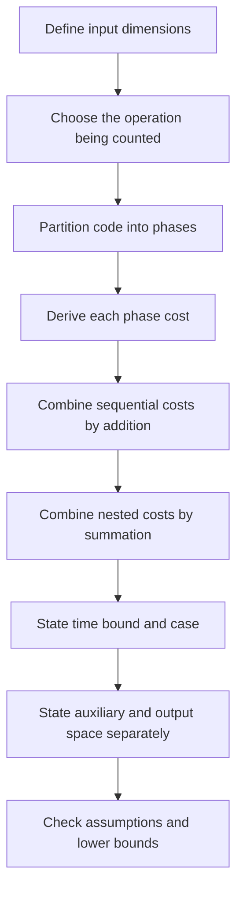

# Complexity Analysis: Interview Deep Dive

Complexity analysis is a proof about how resource use grows as the input grows. Interviewers are not testing whether you can recite `O(n log n)`; they are testing whether you can define the input, count dominant work, explain memory ownership, and compare alternatives under realistic constraints.

## Learning Contract

After this chapter, you should be able to:

- define one or more input dimensions before analyzing code;
- derive loop, recursion, and data-structure costs rather than guess them;
- distinguish worst-case, expected, amortized, and output-sensitive bounds;
- separate input storage, auxiliary space, recursion stack, and returned output;
- explain when two algorithms with the same Big-O behave differently.

## Recognition Map

| Code shape | First hypothesis | What must be verified |
|---|---:|---|
| One monotonic index crossing `n` elements | `O(n)` | Work inside the loop is bounded |
| Two independent full-range loops | `O(n^2)` | Inner bound does not shrink or depend on outer state |
| Inner loop advances globally, never resets | Often `O(n)` total | Every element is charged a constant number of times |
| Problem size halves each step | `O(log n)` | The discarded fraction is bounded away from zero |
| Divide into subproblems and combine | Recurrence | Number, size, and combine cost of subproblems |
| Dynamic array occasionally resizes | Amortized `O(1)` append | Capacity grows geometrically |
| Work proportional to answer size `k` | `O(f(n) + k)` | Returning the output itself costs `Omega(k)` |

## A Defensible Analysis Process



### 1. Name the Input Dimensions

Do not automatically call everything `n`. For a graph, use `V` vertices and `E` edges. For two strings, use `m` and `n`. For a matrix, use `rows` and `cols`. This prevents false statements such as calling adjacency-list traversal `O(V^2)` when the correct bound is `O(V + E)`.

### 2. Count a Meaningful Operation

Choose comparisons, hash lookups, pointer advances, heap operations, or visited edges. Wall-clock time is not the proof unit because hardware and runtime behavior vary.

### 3. Sum Before Simplifying

Sequential phases add: `O(n) + O(n log n) + O(k)`. The asymptotic summary is `O(n log n + k)`, not automatically `O(n log n)`, because `k` may be independent or represent required output.

### 4. Analyze Nested Work as a Sum

A triangular loop performs:

```text
(n - 1) + (n - 2) + ... + 1 = n(n - 1) / 2
```

That is `Theta(n^2)`. A two-pointer loop may look nested but still be `Theta(n)` if each pointer advances at most `n` times across the entire execution.

### 5. Account for Space Ownership

| Memory | Usually counted as auxiliary? | Example |
|---|---|---|
| Input array supplied by caller | No | `int[] values` |
| New hash map used by algorithm | Yes | frequency table |
| Recursive call frames | Yes | DFS depth |
| Returned answer required by API | Report separately | list of all matches |
| In-place mutation | Usually `O(1)` auxiliary | array reversal |

## Worked Interview Trace

Consider finding all pairs in a sorted array whose sum equals a target.

- Sorting is unnecessary if the precondition already guarantees sorted input.
- The left pointer only moves right.
- The right pointer only moves left.
- At most `n - 1` pointer moves occur.
- Each iteration performs constant work.

Therefore time is `Theta(n)` and auxiliary space is `Theta(1)`, excluding the returned pairs. If all duplicate index pairs must be returned, output size can be `Theta(n^2)`; no implementation can return that output in `O(n)` total time.

## Model Interview Questions and Answers

### 1. What is the difference between Big-O, Big-Omega, and Big-Theta?

**Answer:** Big-O is an asymptotic upper bound, Big-Omega is a lower bound, and Big-Theta is a tight bound with matching upper and lower growth. Saying binary search is `O(n)` is technically an upper bound but uninformative; `Theta(log n)` is the useful tight bound for its standard worst-case comparison count.

### 2. Are two nested loops always quadratic?

**Answer:** No. Analyze the total number of inner iterations. If an inner pointer never resets, both pointers may advance only `n` times total. If the inner range halves each outer iteration, the work may form a geometric series. Nesting describes syntax, not total work.

### 3. Why is dynamic-array append amortized `O(1)`?

**Answer:** Most appends write one element. A resize copies all current elements, but geometric capacity growth means an element is copied only a constant number of times across many appends. For `n` appends, total copying is `O(n)`, so average cost per append is `O(1)` amortized.

### 4. How do you analyze recursive space?

**Answer:** Multiply per-frame auxiliary state by maximum simultaneous recursion depth, not total calls. Balanced binary recursion can make `O(n)` calls while using only `O(log n)` stack depth. A skewed tree can require `O(n)` depth.

### 5. When should complexity use multiple variables?

**Answer:** Whenever inputs can grow independently. Merging arrays of lengths `m` and `n` is `Theta(m + n)`. Replacing both with `n` hides behavior and can make follow-up reasoning about highly unequal inputs incorrect.

### 6. Why do constants still matter in production?

**Answer:** Big-O predicts scaling, not exact latency. Cache locality, allocations, branch behavior, object overhead, and network or disk access can dominate within the expected input range. State the asymptotic result first, then discuss constants and operational constraints.

## Interviewer Follow-Up Ladder

1. Give the worst-case bound.
2. Tighten it to an expected or amortized bound where justified.
3. Identify the lower bound imposed by reading input or producing output.
4. Compare an alternative with different time-space trade-offs.
5. Explain behavior when input grows by 10x.

## Common Failure Modes

- Giving a bound before defining `n`.
- Multiplying loop bounds without checking pointer movement.
- Ignoring hidden costs such as substring copies, sorting, or hash collisions.
- Calling recursive code `O(1)` space because no explicit collection is allocated.
- Dropping an independent output term.
- Claiming average hash lookup is guaranteed constant time.

## Practice Ladder

1. Analyze a loop whose step doubles each iteration.
2. Analyze all substrings generated explicitly versus counted implicitly.
3. Derive DFS time and stack space for balanced and skewed trees.
4. Prove the amortized cost of a queue implemented with two stacks.
5. Compare sorting plus scanning against hashing for duplicate detection.

## Runnable Reference

Study and run [`ComplexityDemo.java`](https://github.com/vinayreddykalluri/SDE2-Interview-Handbook/blob/master/examples/java/src/main/java/io/github/vinayreddykalluri/interviewhandbook/codingfoundations/complexity/ComplexityDemo.java). Before executing it, predict the operation count for each input size and explain which result is asymptotic versus implementation-specific.

## Sixty-Second Revision

- Define inputs.
- Count meaningful operations.
- Sum sequential phases.
- Sum nested work; do not infer from indentation.
- State worst, expected, or amortized explicitly.
- Separate auxiliary, stack, and output space.
- Preserve independent variables and output terms.

