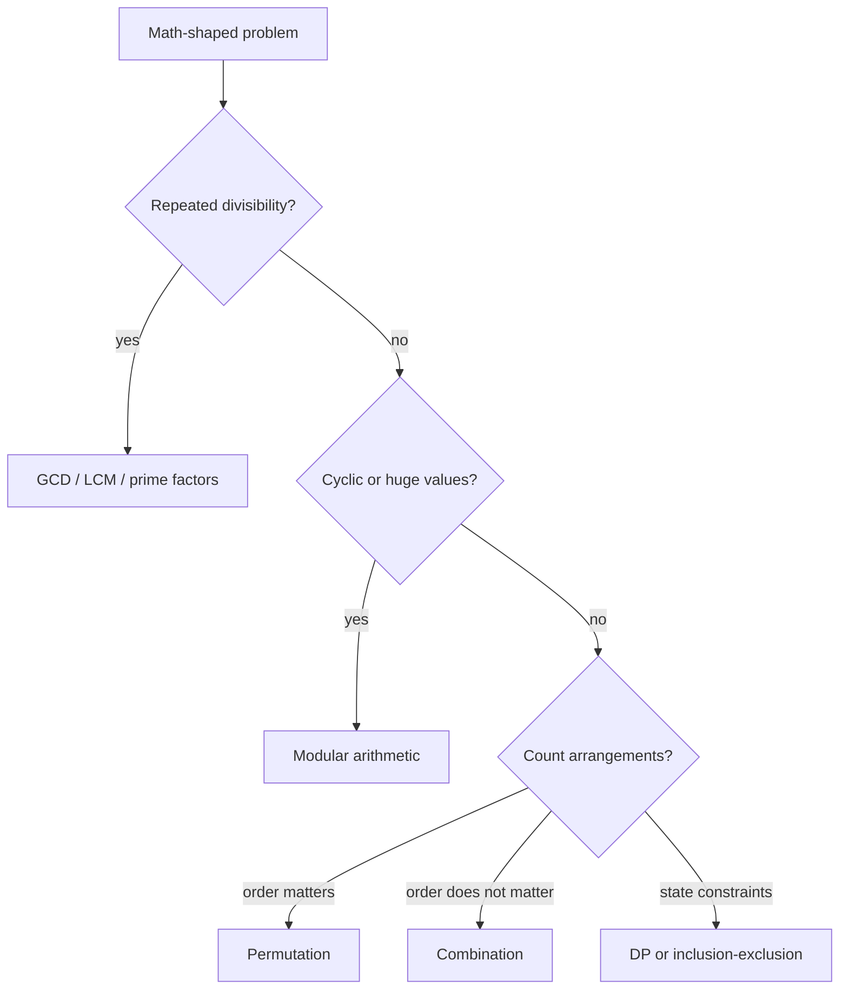

# Algorithmic Math: Interview Deep Dive

Math questions in coding interviews rarely require advanced theory. They require precise integer reasoning: divisibility, remainders, bounds, overflow, and the ability to replace brute force with a property that can be proved.

## Learning Contract

You should be able to:

- use divisibility and modular arithmetic without sign mistakes;
- derive Euclid's algorithm and explain its logarithmic convergence;
- test primality in `O(sqrt(n))` without overflow;
- choose between permutation, combination, and dynamic counting;
- make intermediate arithmetic safe in Java;
- identify when floating-point arithmetic is inappropriate.

## Decision Map



## Core Tools

### Divisibility and GCD

Euclid's identity is `gcd(a, b) = gcd(b, a mod b)`. The remainder is smaller than the divisor, so the second argument decreases until it reaches zero. The number of iterations is `O(log min(a, b))`.

For nonnegative values:

```text
gcd(48, 18)
= gcd(18, 12)
= gcd(12, 6)
= gcd(6, 0)
= 6
```

Compute LCM as `abs(a / gcd(a, b) * b)` rather than `abs(a * b) / gcd(a, b)` to reduce overflow risk. Even then, use `long` or an explicit overflow check when inputs are large.

### Modular Arithmetic

For addition and multiplication:

```text
(a + b) mod m = ((a mod m) + (b mod m)) mod m
(a * b) mod m = ((a mod m) * (b mod m)) mod m
```

In Java, `%` is remainder, not mathematical modulo. A negative dividend can produce a negative result. Use `Math.floorMod(value, modulus)` when a canonical result in `[0, modulus)` is required.

### Prime Testing

If `n` is composite, at least one factor is at most `sqrt(n)`. Test divisors while `d <= n / d` instead of `d * d <= n` to avoid integer overflow. Skip even divisors after handling `2`.

### Counting

- Permutations: order matters.
- Combinations: order does not matter.
- Repetition changes the formula.
- Constraints between choices often invalidate a direct formula and require DP or case analysis.

## Worked Interview Trace: Fast Exponentiation

To compute `base^exponent`, inspect the exponent's binary representation.

- If the current bit is 1, multiply the answer by the current base.
- Square the base.
- Shift the exponent right.
- Repeat until the exponent is zero.

Each step removes one exponent bit, so time is `Theta(log exponent)` and iterative auxiliary space is `Theta(1)`. With a modulus, reduce after each multiplication and widen operands before multiplication.

## Model Interview Questions and Answers

### 1. Why does Euclid's algorithm work?

**Answer:** Any common divisor of `a` and `b` also divides `a - q*b`. Since `a mod b = a - floor(a/b)*b`, replacing `(a, b)` with `(b, a mod b)` preserves the set of common divisors while reducing the second value.

### 2. Why test prime divisors only through the square root?

**Answer:** Composite `n = a*b` cannot have both factors greater than `sqrt(n)`, because their product would exceed `n`. If no divisor at or below the square root exists, no paired factor exists above it.

### 3. How do you avoid overflow in midpoint or average calculations?

**Answer:** Use `low + (high - low) / 2` for a midpoint when bounds are ordered. For an average, widening to `long` before addition may be required. Algebraic rewrites reduce risk but do not replace range analysis.

### 4. What is wrong with using floating point to test a perfect square?

**Answer:** Floating-point rounding can misclassify large integers. Use integer binary search, or compute a candidate root and verify multiplication with widened arithmetic or division-based bounds.

### 5. What does modulo preserve and what does it not preserve?

**Answer:** Modulo preserves equivalence under addition, subtraction, and multiplication. Division requires a modular inverse and is not generally valid. Ordering is also not preserved: a smaller remainder does not imply a smaller original value.

### 6. When should you use combinatorics instead of enumeration?

**Answer:** Use a formula when choices are independent and the counting model is exact. Use enumeration, DP, or inclusion-exclusion when constraints couple choices. Always estimate whether the formula's intermediate values fit the selected numeric type.

## Production Relevance

Math errors often become security or reliability defects:

- overflow can bypass size and payment checks;
- negative remainder can select an invalid shard;
- weak hashing or randomization can create collisions;
- floating-point currency calculations can lose cents;
- clock and duration arithmetic can overflow or mix units.

## Common Failure Modes

- Treating Java remainder as always nonnegative.
- Calculating `a * b` before widening to `long`.
- Forgetting zero and negative input contracts.
- Using factorial formulas whose intermediates overflow.
- Assuming integer division rounds to nearest.
- Applying a modular inverse when the divisor is not invertible modulo `m`.

## Practice Ladder

1. Implement GCD and overflow-aware LCM.
2. Count primes below `n` with a sieve.
3. Compute modular exponentiation.
4. Determine whether an integer is a perfect square without floating point.
5. Count paths in a grid first combinatorially, then with blocked cells using DP.

## Runnable Reference

Study [`MathUtils.java`](https://github.com/vinayreddykalluri/SDE2-Interview-Handbook/blob/master/examples/java/src/main/java/io/github/vinayreddykalluri/interviewhandbook/codingfoundations/math/MathUtils.java). Add tests for zero, negatives, `Integer.MAX_VALUE`, and values whose intermediate products exceed `int`.

## Sixty-Second Revision

- Use properties before brute force.
- Prefer division-based bounds when multiplication may overflow.
- Use `Math.floorMod` for canonical modulo.
- GCD converges logarithmically.
- State numeric range and type.
- Verify whether order, repetition, and constraints change a counting formula.

