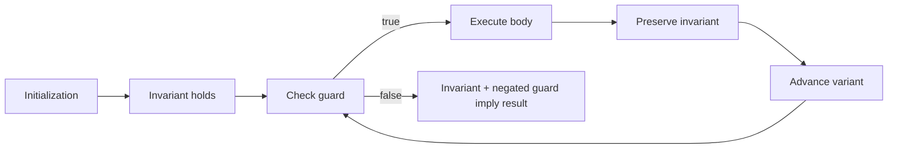

# Loop Reasoning: Interview Deep Dive

A correct loop is a small proof. You need an initialization that establishes an invariant, a body that preserves it, and a progress measure that guarantees termination.

## Learning Contract

You should be able to:

- state a loop invariant before writing the body;
- select inclusive or half-open bounds consistently;
- prove termination using a monotonic progress measure;
- derive total work when inner loops depend on outer state;
- replace fragile nested logic with explicit state transitions.

## Loop Proof Model



## The Four Questions

Before accepting a loop, answer:

1. **What region has already been processed?**
2. **What fact is true about that region?**
3. **What changes every iteration?**
4. **Why can that change happen only finitely many times?**

For an array compaction loop, a useful invariant is: `values[0..write)` contains exactly the kept elements from `values[0..read)` in original order.

## Worked Interview Trace: Stable Compaction

Goal: remove all zero values in place while preserving nonzero order.

- `read` scans every element.
- `write` identifies the next output position.
- When `values[read]` is nonzero, assign it to `values[write]` and increment `write`.
- After scanning, positions `[0, write)` contain the answer.

The read pointer advances `n` times and write advances at most `n` times. Time is `Theta(n)` and auxiliary space is `Theta(1)`.

The invariant explains correctness better than saying "use two pointers": before each iteration, the output prefix is already correct and contains every accepted element seen so far.

## Boundary Discipline

Use half-open intervals whenever practical:

```text
[begin, end)
length = end - begin
empty when begin == end
last valid index = end - 1
```

This convention composes naturally for slices and avoids `+1` in length calculations. Inclusive bounds are valid, but mixing conventions inside one algorithm is a common source of defects.

## Model Interview Questions and Answers

### 1. What is a loop invariant?

**Answer:** A proposition that is true before the first iteration, remains true after every body execution, and combines with loop termination to prove the postcondition. It should describe processed and unprocessed state precisely.

### 2. How do you prove a loop terminates?

**Answer:** Identify a variant, usually a nonnegative integer, that moves strictly toward a bound each iteration. Examples include remaining elements, interval width, or number of unvisited nodes. Show that no branch can skip progress indefinitely.

### 3. Why are nested loops sometimes linear?

**Answer:** If the inner pointer is shared across outer iterations and never moves backward, its total movement is bounded by `n`. Count pointer movements over the entire execution rather than multiplying syntactic loop limits.

### 4. When is a `for` loop preferable to a `while` loop?

**Answer:** Use `for` when initialization, guard, and regular update form one clear iteration policy. Use `while` when progress depends on branches or multiple pointers. Correctness matters more than syntax; the progress rule must remain visible.

### 5. How do you prevent off-by-one errors?

**Answer:** Write the interval convention next to the variables, derive the guard from that convention, and test empty, one-element, and last-element cases. Avoid compensating `+1` and `-1` operations without a stated reason.

### 6. What should you say while coding a loop in an interview?

**Answer:** State the invariant, describe which pointer or counter progresses, and explain the exit condition. Then trace a boundary case. This demonstrates control of correctness rather than trial-and-error coding.

## Production Relevance

Loop defects cause more than wrong interview output:

- pagination can skip or duplicate records;
- retry loops can become infinite;
- buffer loops can write out of bounds;
- polling loops can overload dependencies;
- cleanup loops can leak resources when an early exit bypasses finalization.

When work can block or fail, include cancellation, timeout, and bounded retry policies.

## Common Failure Modes

- Incrementing a pointer in only one branch.
- Mutating collection size while relying on an original bound.
- Using `<= length` for zero-based arrays.
- Returning early before required cleanup.
- Resetting a supposedly monotonic pointer.
- Failing to prove that a shrinking window can actually shrink.

## Practice Ladder

1. Trace stable compaction for empty, all-zero, and no-zero arrays.
2. Rotate an array using three reversals and prove each loop range.
3. Merge two sorted arrays and state the output-prefix invariant.
4. Analyze a triangular nested loop exactly.
5. Write a bounded retry loop with timeout and exponential backoff pseudocode.

## Runnable Reference

Use [`LoopPatterns.java`](https://github.com/vinayreddykalluri/SDE2-Interview-Handbook/blob/master/examples/java/src/main/java/io/github/vinayreddykalluri/interviewhandbook/codingfoundations/loops/LoopPatterns.java). For each loop, write its invariant and variant before running it.

## Sixty-Second Revision

- Initialization establishes the invariant.
- The body preserves it.
- A variant proves termination.
- Interval notation controls boundaries.
- Count total movement, not indentation.
- Trace empty, singleton, and final-index cases.

