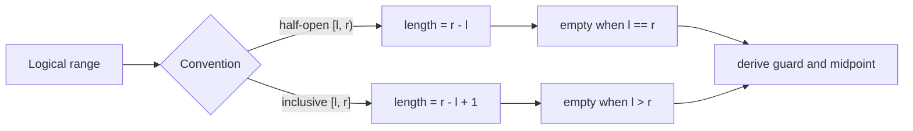

# Index and Boundary Reasoning: Interview Deep Dive

Indexing questions test whether you can translate a logical range into physical positions without losing elements, reading outside storage, or creating arithmetic overflow.

## Learning Contract

You should be able to:

- use half-open and inclusive intervals deliberately;
- derive lengths, midpoints, and subranges from interval definitions;
- map between one-dimensional and multidimensional coordinates;
- reason about circular indices and negative offsets;
- design boundary tests before implementation.

## Interval Model



## Core Formulas

| Problem | Formula | Preconditions |
|---|---|---|
| Half-open length | `right - left` | `0 <= left <= right <= n` |
| Inclusive length | `right - left + 1` | `0 <= left <= right < n` |
| Safe midpoint | `left + (right - left) / 2` | ordered bounds |
| Flatten row-major | `row * cols + col` | product fits numeric type |
| Recover row | `index / cols` | `cols > 0` |
| Recover column | `index % cols` | nonnegative index |
| Circular advance | `(index + step) mod capacity` | canonical modulo, capacity > 0 |

Use `Math.floorMod(index + step, capacity)` when offsets can be negative.

## Worked Interview Trace: Binary Search Interval

With half-open interval `[low, high)`:

- Candidate count is `high - low`.
- Initialize `low = 0` and `high = values.length`.
- Compute `mid = low + (high - low) / 2`.
- If discarding `mid` and everything left of it, set `low = mid + 1`.
- If keeping `mid` as a possible answer, set `high = mid`.
- Terminate when `low == high`.

Every update strictly reduces interval width, and the answer remains inside the candidate interval.

## Coordinate Translation

For a matrix with `rows` and `cols` stored row-major, coordinate `(r, c)` maps to `r * cols + c`. Validate both coordinates before calculating the offset. For very large dimensions, calculate with `long` because the product can overflow even when each coordinate fits an `int`.

When traversing neighbors, separate direction data from bounds:

```text
directions = (-1,0), (1,0), (0,-1), (0,1)
nextRow = row + dr
nextCol = col + dc
valid iff 0 <= nextRow < rows and 0 <= nextCol < cols
```

## Model Interview Questions and Answers

### 1. Why are half-open intervals useful?

**Answer:** Their length is simply `right - left`, empty ranges use equal endpoints, and adjacent ranges `[a,b)` and `[b,c)` compose without overlap. They align with Java array and collection conventions.

### 2. How does the safe midpoint formula prevent overflow?

**Answer:** `left + (right - left) / 2` avoids adding two potentially large positive bounds. It still assumes the subtraction is representable, which holds for ordinary nonnegative array indices.

### 3. What is the difference between an index and an offset?

**Answer:** An index names a logical position in a sequence; an offset is a displacement from a base. They may coincide for zero-based arrays but diverge for slices, views, files, and circular buffers. Naming them separately prevents accidental double-offsetting.

### 4. How do you handle a negative circular index in Java?

**Answer:** Use `Math.floorMod(index, capacity)`. Java's `%` may return a negative remainder, so `-1 % capacity` is not the last valid slot.

### 5. What boundary cases should be traced first?

**Answer:** Empty input, one element, first position, last position, target absent just below range, and target absent just above range. For matrices, include one row, one column, corners, and invalid dimensions.

### 6. How can flattening a matrix overflow?

**Answer:** `row * cols` is evaluated in the operand type. Cast or store one operand as `long` before multiplication and validate that the final offset fits the storage API's index type.

## Common Failure Modes

- Mixing `[l,r)` and `[l,r]` updates.
- Using `length - 1` without handling empty input.
- Applying modulo with zero capacity.
- Checking a flattened offset but not its original row and column.
- Calculating products in `int` before assigning to `long`.
- Treating a byte offset as an element index.

## Practice Ladder

1. Implement lower bound with `[low, high)`.
2. Reverse exactly the slice `[from, to)`.
3. Map spiral-matrix traversal coordinates safely.
4. Implement circular-buffer next and previous indices with negative steps.
5. Validate a file range defined by byte offset and byte length.

## Runnable Reference

Study [`Indexing.java`](https://github.com/vinayreddykalluri/SDE2-Interview-Handbook/blob/master/examples/java/src/main/java/io/github/vinayreddykalluri/interviewhandbook/codingfoundations/indexing/Indexing.java). Add explicit tests for empty ranges, the last valid index, negative circular movement, and dimension-product overflow.

## Sixty-Second Revision

- Declare the interval convention.
- Derive length and guard from it.
- Use an overflow-safe midpoint.
- Distinguish base, offset, and logical index.
- Use floor-modulo for negative circular movement.
- Test empty, first, last, and absent cases.

