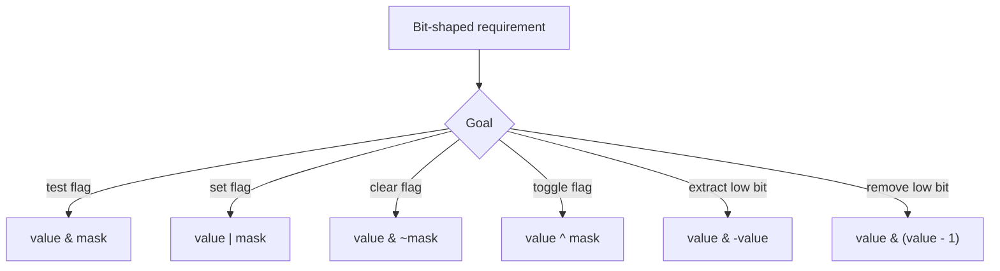

# Bit Manipulation: Interview Deep Dive

Bit manipulation is useful when the problem is fundamentally about compact flags, parity, powers of two, subsets, or fixed-width integer representation. It is not a substitute for clear code when ordinary arithmetic expresses the intent better.

## Learning Contract

You should be able to:

- explain two's-complement signed representation;
- build, test, set, clear, and toggle masks;
- distinguish arithmetic and logical right shifts in Java;
- derive common XOR properties;
- enumerate subsets safely;
- identify width, sign, and overflow assumptions.

## Bit Operation Map



## Representation Essentials

Java `int` uses 32-bit two's complement and `long` uses 64-bit two's complement. The most significant bit is the sign bit.

- `>>` is arithmetic right shift and replicates the sign bit.
- `>>>` is logical right shift and inserts zero bits.
- `<<` shifts left and discards bits that exceed the fixed width.
- Shift distance is masked by the width, so validate assumptions rather than expecting large shifts to produce zero.

Use `1L << bit` for a `long` mask. Writing `1 << bit` performs the shift as an `int` before any later widening.

## Core Identities

| Identity | Meaning |
|---|---|
| `x ^ x = 0` | equal values cancel |
| `x ^ 0 = x` | zero is XOR identity |
| `x & (x - 1)` | clears the lowest set bit |
| `x & -x` | isolates the lowest set bit |
| `x > 0 && (x & (x - 1)) == 0` | positive power of two |
| `mask & (1 << bit)` | test a bit |

The positivity check in the power-of-two test matters because zero has no set bits and negative values have sign-related patterns.

## Worked Interview Trace: Single Non-Duplicate

If every integer appears exactly twice except one:

```text
answer = 0
for each value:
    answer ^= value
```

XOR is associative and commutative, duplicate pairs cancel, and zero contributes nothing. Time is `Theta(n)` and auxiliary space is `Theta(1)`.

This argument fails if elements can appear three times or if two values are unique; those variants require different bit-count or partition reasoning.

## Model Interview Questions and Answers

### 1. Why does `x & (x - 1)` clear the lowest set bit?

**Answer:** Subtracting one changes the lowest set bit to zero and turns all lower zero bits into ones. AND preserves higher bits and clears that lowest set bit plus the changed lower region.

### 2. What is the difference between `>>` and `>>>`?

**Answer:** `>>` preserves sign by filling with the original sign bit. `>>>` treats the value as an unsigned bit pattern for shifting and fills with zeros. Java still stores the result in a signed type.

### 3. How do you test whether bit `k` is set?

**Answer:** Build a correctly typed mask and test `(value & (1L << k)) != 0` for a `long`. Validate `k` against the type width.

### 4. When is XOR insufficient for duplicate problems?

**Answer:** XOR loses frequency information beyond parity. It solves paired cancellation, but counts modulo three, multiple unique values, and ordered duplicate requirements need additional state or bit partitions.

### 5. How do bitmasks represent subsets?

**Answer:** Bit `i` indicates whether element `i` is included. Enumerating masks from zero to `2^n - 1` enumerates all subsets in `Theta(n * 2^n)` time if each subset is materialized. Width and exponential-growth limits must be stated.

### 6. What bit-manipulation risks appear in production?

**Answer:** Sign extension, incorrect mask width, protocol endianness, accidental flag overlap, and silent truncation. Prefer named constants, explicit widths, and serialization tests.

## Common Failure Modes

- Using `1 << bit` when a `long` mask is required.
- Forgetting that zero passes the raw `x & (x - 1)` equality.
- Shifting a negative value without choosing arithmetic or logical semantics.
- Treating Java integer types as unsigned.
- Enumerating `2^n` subsets without discussing feasibility.
- Packing fields without documenting bit ranges.

## Practice Ladder

1. Count set bits with Brian Kernighan's method.
2. Reverse bits in a 32-bit integer.
3. Find two unique values when all others appear twice.
4. Generate subsets with a mask and explain exponential cost.
5. Design named feature flags and validate that masks do not overlap.

## Runnable Reference

Run [`BitOps.java`](https://github.com/vinayreddykalluri/SDE2-Interview-Handbook/blob/master/examples/java/src/main/java/io/github/vinayreddykalluri/interviewhandbook/codingfoundations/bitmanipulation/BitOps.java). Add cases for zero, negative values, bit 31, bit 63, and logical versus arithmetic right shift.

## Sixty-Second Revision

- State width and signedness.
- Type the mask before shifting.
- Know set, clear, toggle, and test operations.
- XOR preserves parity, not full frequency.
- Validate zero for power-of-two checks.
- Discuss exponential limits for subset masks.

