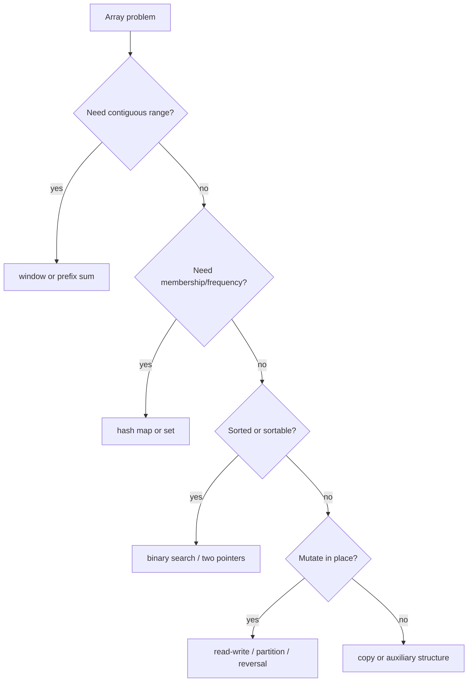

# Arrays: Interview Deep Dive

Arrays are the base representation behind many interview patterns. Strong candidates reason about contiguous storage, index invariants, mutation ownership, and whether the problem needs scanning, partitioning, preprocessing, or a different data structure.

## Learning Contract

You should be able to:

- explain array access, traversal, insertion, and deletion costs;
- choose between copying and in-place mutation;
- derive read/write, partition, rotation, and merge invariants;
- recognize when hashing, prefix sums, windows, or sorting should augment an array;
- account for cache locality and primitive versus boxed storage in Java.

## Pattern Selection Map



## Storage and Cost Model

| Operation | Typical cost | Reason |
|---|---:|---|
| Read or write by valid index | `Theta(1)` | address computed from base plus offset |
| Full traversal | `Theta(n)` | every element inspected |
| Insert/delete at end of fixed array | not supported directly | fixed length |
| Insert/delete near front | `Theta(n)` | elements shift |
| Copy array | `Theta(n)` time and space | all elements duplicated |
| Sort primitive array | generally `O(n log n)` | implementation-specific algorithm |

Primitive arrays store values compactly. Arrays of objects store references, and referenced objects may be scattered in memory. This affects constants and cache behavior even when asymptotic complexity is unchanged.

## Core Invariants

### Read-Write Compaction

Before each iteration, `[0, write)` is the final compacted prefix and `[write, read)` contains no needed output. Read advances over every input; write advances only for retained values.

### Partition

Maintain regions such as:

```text
[0, low)       values < pivot
[low, current) values == pivot or already classified
[current, high] unknown
(high, n)      values > pivot
```

Write the region definition before coding. It determines updates and termination.

### Rotation

Reversal-based right rotation by `k`:

1. normalize `k` into `[0,n)`;
2. reverse the whole array;
3. reverse the first `k` elements;
4. reverse the remaining elements.

Time is `Theta(n)` and auxiliary space is `Theta(1)`.

## Worked Interview Trace: Move Zeros

For `[0, 1, 0, 3, 12]`:

- read 0: skip;
- read 1: write at 0;
- read 0: skip;
- read 3: write at 1;
- read 12: write at 2;
- fill `[3,n)` with zero.

The stable result is `[1,3,12,0,0]`. The invariant guarantees relative order; time is `Theta(n)` and space is `Theta(1)`.

## Model Interview Questions and Answers

### 1. Why is array indexing constant time?

**Answer:** For fixed-width elements, the address is computed from base address plus `index * elementWidth`. Bounds checking and reference indirection add constants but do not depend on array length.

### 2. When should an array be modified in place?

**Answer:** When the API permits mutation, preserving the original is unnecessary, and the space reduction matters. State the mutation contract because callers may share the array or expect immutability.

### 3. How do you remove elements from an array efficiently?

**Answer:** Use a write pointer to compact retained values in one pass. Physical array length cannot change, so return the logical length or create a correctly sized copy after compaction.

### 4. What is the difference between a partition and a sort?

**Answer:** Partition enforces a regional predicate around a pivot or category, usually in linear time, but does not order values within regions. Sorting establishes total order and usually costs `O(n log n)`.

### 5. Why can a boxed `Integer[]` be slower than `int[]`?

**Answer:** It stores references and requires object indirection, uses more memory, and may involve boxing or unboxing. This reduces cache density and adds runtime overhead while Big-O stays the same.

### 6. How do you discuss copying versus views?

**Answer:** A copy owns independent storage and costs linear time and space. A view can be constant-time but shares backing data, so mutation and lifetime semantics become part of correctness.

## Production Relevance

Arrays appear in buffers, serialization, image data, columnar processing, and protocol frames. Validate lengths before allocation, avoid integer overflow in byte-size calculations, and clear sensitive data when required.

## Common Failure Modes

- Losing elements by incrementing write before assignment.
- Mutating caller-owned input without stating it.
- Rotating with negative or oversized `k` without normalization.
- Treating a logical compacted length as physical length.
- Using repeated front deletion and creating quadratic shifts.
- Forgetting empty-array behavior in `length - 1` expressions.

## Practice Ladder

1. Stable-remove a target value and return logical length.
2. Dutch-national-flag partition three categories.
3. Rotate left and right using reversals.
4. Merge sorted arrays into existing trailing capacity.
5. Compute the first missing positive value in place.

## Runnable Reference

Study [`ArrayOps.java`](https://github.com/vinayreddykalluri/SDE2-Interview-Handbook/blob/master/examples/java/src/main/java/io/github/vinayreddykalluri/interviewhandbook/codingfoundations/arrays/ArrayOps.java). Trace every mutation with explicit region boundaries before execution.

## Sixty-Second Revision

- Arrays provide constant-time indexed access.
- Insertion and deletion can require shifts.
- State mutation ownership.
- Define regions for compaction and partition.
- Normalize rotation distance.
- Use another pattern when the query, not storage, drives the problem.

