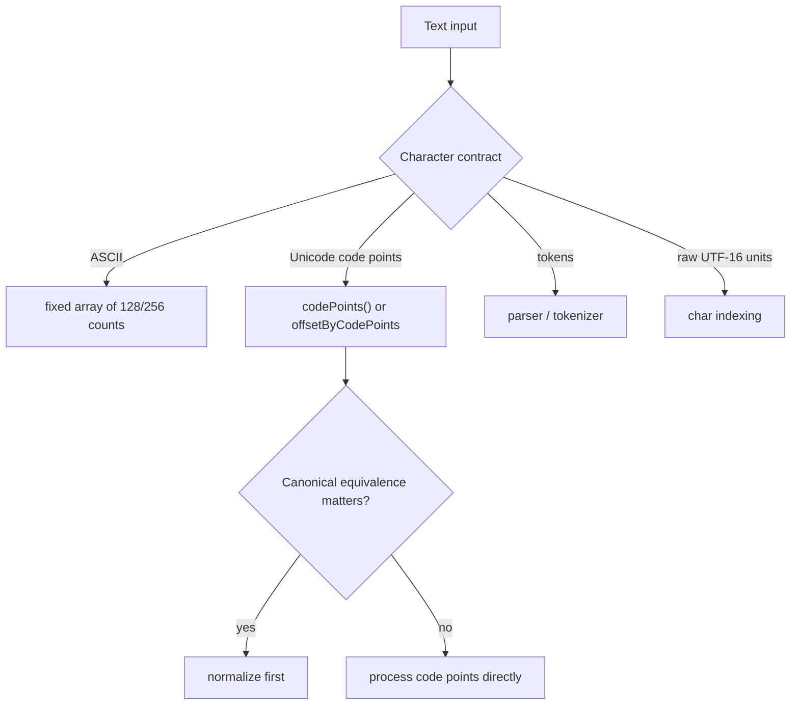

# Strings: Interview Deep Dive

String problems combine sequence algorithms with representation details. A correct answer depends on whether the input is ASCII, Unicode text, normalized text, tokens, or raw code units. State that contract before choosing arrays, maps, windows, or two pointers.

## Learning Contract

You should be able to:

- explain Java `String` immutability and index semantics;
- distinguish UTF-16 code units from Unicode code points;
- choose between concatenation, `StringBuilder`, character arrays, and streaming;
- normalize and compare text under an explicit product requirement;
- recognize palindrome, frequency, window, and parsing patterns;
- estimate the hidden cost of substring creation and repeated copying.

## Representation Decision

## Java String Mental Model

Java's public indexing APIs operate on UTF-16 code units:

- `length()` returns code-unit count;
- `charAt(i)` returns one `char` code unit;
- a supplementary Unicode character uses a surrogate pair;
- `codePointAt` and `codePoints()` expose code points.

The runtime may use compact internal storage for some strings, but that is an implementation detail, not an API guarantee. Interview reasoning should use the specified behavior.

Strings are immutable. Operations that appear to modify text create another string or use a mutable helper. Repeated `result = result + piece` in a loop can copy a growing prefix repeatedly and become quadratic.

## Pattern Selection

| Requirement | Typical technique | Key assumption |
|---|---|---|
| Compare mirrored positions | two pointers | comparison unit is defined |
| Count symbols | array or hash map | alphabet size and representation known |
| Longest valid substring | sliding window | validity can be updated incrementally |
| Build output incrementally | `StringBuilder` | one mutable owner |
| Parse nested syntax | stack or recursive descent | grammar is explicit |
| Search fixed pattern | KMP/Z/hash/rolling hash | preprocessing cost is justified |

## Worked Interview Trace: Longest Unique Substring

Maintain a half-open window `[left, right]` while expanding `right`.

For each symbol:

- look up its most recent index;
- move `left` to `max(left, previous + 1)`;
- record the new index;
- update best length as `right - left + 1`.

The max prevents `left` from moving backward when the previous occurrence lies outside the current window. Time is `Theta(n)` expected with hashing, and space is bounded by the alphabet represented.

For full Unicode code points, indexes into a `String` require care because code-point position and UTF-16 offset differ.

## Model Interview Questions and Answers

### 1. Why is `String` immutable in Java?

**Answer:** Immutability enables safe sharing, stable hash codes, string-pool reuse, and simpler concurrency. It also means transformations allocate new values unless a mutable builder or array is used.

### 2. Is a Java `char` always one user-visible character?

**Answer:** No. It is one UTF-16 code unit. A Unicode code point can require two code units, and a user-perceived grapheme can contain multiple code points. The problem contract determines the correct comparison unit.

### 3. Why can looped string concatenation be quadratic?

**Answer:** Each immutable concatenation may copy the entire accumulated prefix into a new object. Copying lengths `1 + 2 + ... + n` produces quadratic total work. A `StringBuilder` grows a mutable buffer amortized over appends.

### 4. When is a frequency array better than a hash map?

**Answer:** When the alphabet is small, known, and directly indexable, such as lowercase English letters. It uses less overhead and deterministic access. A map is safer for sparse or large symbol spaces.

### 5. What does Unicode normalization solve?

**Answer:** It converts canonically equivalent code-point sequences into a selected normal form, allowing meaningful equality under that requirement. It does not solve locale-specific case rules or grapheme segmentation by itself.

### 6. Does `substring` always run in constant time?

**Answer:** Do not assume it. Modern Java creates an independent string representation, so creating a substring generally copies the selected range. Analyze against the current API behavior rather than historical implementation details.

## Production Relevance

Text processing must define:

- encoding at system boundaries;
- maximum accepted length;
- normalization and case-folding policy;
- locale requirements;
- malformed-input behavior;
- whether logs and error messages may expose sensitive text.

A technically correct ASCII solution can be a production defect if the product accepts international text.

## Common Failure Modes

- Treating `char` as a full Unicode character.
- Calling `toLowerCase()` without a locale policy.
- Building output with immutable concatenation in a loop.
- Moving a window's left boundary backward.
- Using a 26-slot array without stating lowercase-English input.
- Parsing by repeated splitting when delimiters can be escaped or nested.

## Practice Ladder

1. Validate a palindrome under an ASCII alphanumeric contract.
2. Repeat using Unicode code points.
3. Find the longest substring without repeated symbols.
4. Group anagrams with a stable key.
5. Implement basic run-length encoding and define malformed cases.
6. Parse a nested expression with explicit grammar states.

## Runnable Reference

Study [`StringPatterns.java`](https://github.com/vinayreddykalluri/SDE2-Interview-Handbook/blob/master/examples/java/src/main/java/io/github/vinayreddykalluri/interviewhandbook/codingfoundations/strings/StringPatterns.java). Add supplementary-character, empty, whitespace-only, and locale-sensitive test cases.

## Sixty-Second Revision

- Define the text unit: byte, code unit, code point, grapheme, or token.
- Java indexes UTF-16 code units.
- Strings are immutable.
- Use builders for repeated construction.
- State alphabet assumptions.
- Normalize only when the requirement demands it.

