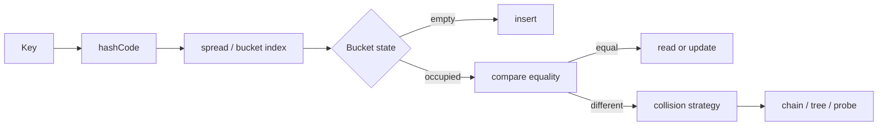

# Hashing: Interview Deep Dive

Hashing trades ordering for fast expected lookup. Interview-ready reasoning includes the hash/equality contract, collision handling, load, memory overhead, deterministic output requirements, and the fact that constant-time access is expected rather than universal.

## Learning Contract

You should be able to:

- explain how keys map to buckets and why collisions are unavoidable;
- preserve the `equals`/`hashCode` contract for Java keys;
- distinguish expected, worst-case, and amortized costs;
- select set, map, multiset, or ordered alternatives;
- derive frequency, complement, grouping, and prefix-state solutions;
- discuss adversarial input and memory trade-offs.

## Hash Table Flow



## Correctness Contract

If two objects are equal, they must produce the same hash code:

```text
a.equals(b) == true  implies  a.hashCode() == b.hashCode()
```

The reverse is not required. Equal hash codes can represent different keys, so equality comparison remains necessary after bucket selection.

Keys should not mutate fields used by equality or hashing while stored in a hash-based collection. Mutation can make an entry unreachable from the bucket implied by its new hash.

## Pattern Selection

| Requirement | Structure | Why |
|---|---|---|
| Existence only | `HashSet` | store each key once |
| Key to one value | `HashMap` | direct association |
| Frequency | map to count | multiset behavior |
| Stable insertion order | `LinkedHashMap` / `LinkedHashSet` | deterministic iteration |
| Sorted keys or range queries | tree-based map/set | hashing has no order |
| Dense small integer domain | array | lower overhead than hashing |

## Worked Interview Trace: Two Sum

For each value at index `i`:

1. compute `needed = target - value` with an appropriate numeric type;
2. check whether `needed` was seen;
3. if present, return the stored index and `i`;
4. otherwise store the current value and index.

Checking before storing prevents pairing an element with itself unless a previous equal element exists. Expected time is `Theta(n)` and auxiliary space is `Theta(n)`.

If deterministic lexicographically smallest index pairs are required, the storage and traversal policy must enforce that requirement explicitly.

## Model Interview Questions and Answers

### 1. Why are collisions unavoidable?

**Answer:** The key space is usually much larger than the finite number of buckets. By the pigeonhole principle, distinct keys can map to the same bucket. A correct table therefore combines hashing with equality and a collision strategy.

### 2. Is hash-map lookup `O(1)`?

**Answer:** It is typically `O(1)` expected under a good distribution and controlled load factor. Worst-case behavior can degrade when many keys collide. State which bound you are claiming and whether the runtime offers collision mitigation.

### 3. What happens if `equals` changes but `hashCode` does not?

**Answer:** The contract can be violated, causing equal keys to occupy or search different buckets. Lookups, removals, and duplicate prevention can fail. Generate both methods from the same immutable identity fields.

### 4. Why can mutable keys break a map?

**Answer:** The entry remains in the bucket chosen at insertion. If a hash-relevant field changes, lookup computes another bucket and may not find the object even though it is still stored.

### 5. When should you not use hashing?

**Answer:** Avoid it when sorted order, predecessor/successor queries, range scans, minimal memory, or strict worst-case latency dominates. Arrays, sorting, trees, tries, or direct indexing may better match the requirement.

### 6. How do you make hash-based output deterministic?

**Answer:** Do not rely on unspecified iteration order. Sort the result, use an insertion-ordered collection with a defined insertion policy, or use an ordered map depending on the required order.

## Production Relevance

Hash tables affect memory and security:

- per-entry objects and spare capacity can exceed raw payload size;
- poor or attacker-controlled distribution can amplify CPU cost;
- unbounded cardinality can exhaust memory;
- nondeterministic ordering can make APIs and tests unstable;
- cache eviction policy requires more than a plain map.

## Common Failure Modes

- Storing before checking in complement problems.
- Forgetting duplicate values or zero counts.
- Mutating hash keys.
- Claiming guaranteed constant time.
- Returning hash iteration order as if specified.
- Using a string-concatenated composite key with ambiguous separators.

## Practice Ladder

1. Find the first duplicate while preserving input order.
2. Group anagrams by a canonical key.
3. Count subarrays with sum `k` using prefix-frequency state.
4. Design an immutable composite key.
5. Compare hash, tree, and sorted-array solutions for membership queries.
6. Add a bounded-size policy to a frequency service.

## Runnable Reference

Run [`HashingDemo.java`](https://github.com/vinayreddykalluri/SDE2-Interview-Handbook/blob/master/examples/java/src/main/java/io/github/vinayreddykalluri/interviewhandbook/codingfoundations/hashing/HashingDemo.java). Test duplicate keys, deliberate collisions, mutable-key hazards, and deterministic result ordering.

## Sixty-Second Revision

- Hash chooses a bucket; equality identifies the key.
- Equal objects require equal hash codes.
- Keys should be hash-stable.
- Lookup is expected constant time, not an unconditional guarantee.
- Hashing does not preserve order.
- Include memory and adversarial-input trade-offs.

