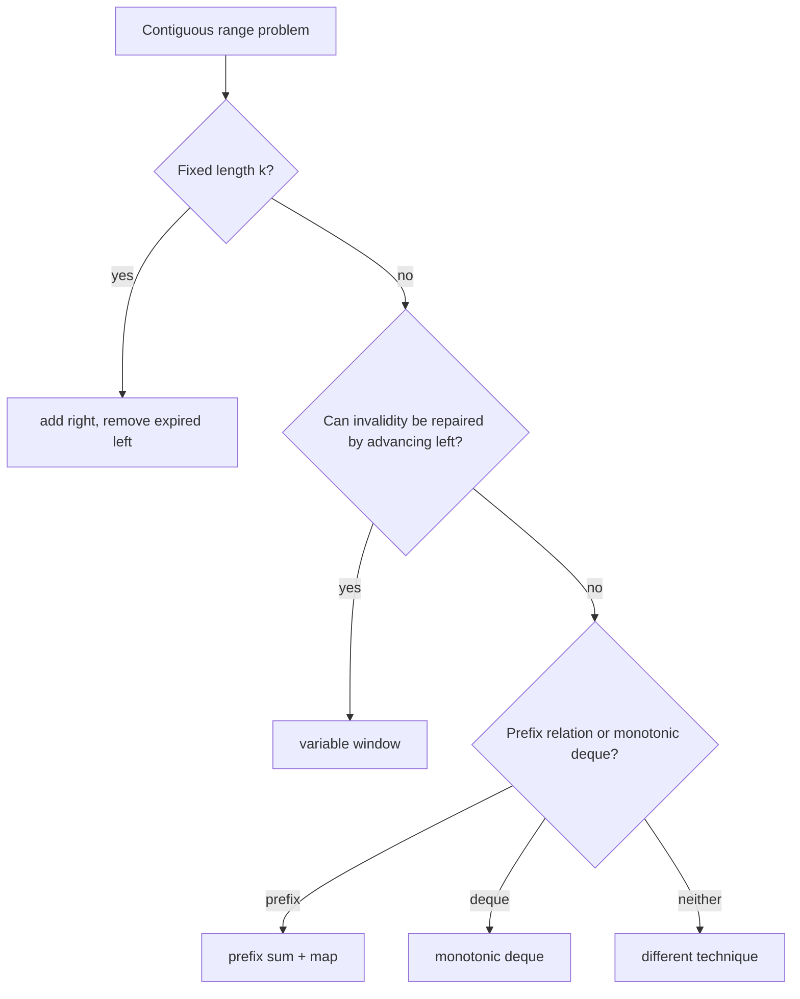

# Sliding Window: Interview Deep Dive

A sliding window is valid when a contiguous range can be updated incrementally as its boundaries move. The crucial question is not "does the prompt mention substring?" but "can validity be restored by moving one boundary monotonically?"

## Learning Contract

You should be able to:

- distinguish fixed-size and variable-size windows;
- state the window invariant and maintained state;
- prove both boundaries move monotonically;
- identify when negative values or nonmonotonic constraints invalidate the technique;
- use counts, sums, deques, or indexes as window state;
- derive linear complexity from total pointer movement.

## Selection Flow

## Window Contract

For a half-open window `[left, right)`:

- include the new right element before incrementing `right`, or define the opposite consistently;
- maintain exactly the state for elements inside the interval;
- shrink while the invariant is violated;
- update the answer at the point where the window is known valid.

A standard variable-window proof charges each element once when it enters and once when it leaves. Total boundary movement is at most `2n`, so time is `Theta(n)` when state updates are constant expected time.

## Worked Interview Trace: Minimum Length with Sum at Least Target

For positive numbers:

1. expand right and add the value;
2. while sum is at least target, record the current length and remove the left value;
3. continue expanding.

Positivity is essential: removing from the left cannot increase the sum, and expanding cannot decrease it. With negative values, the monotonic reasoning fails; a prefix-sum plus monotonic deque may be required.

## Window State Choices

| Constraint | State |
|---|---|
| Sum or average | running sum |
| At most `k` distinct values | frequency map plus distinct count |
| No duplicate symbols | last-seen index or frequency map |
| Maximum in every fixed window | monotonic deque of indexes |
| Replacement budget | frequency counts plus maximum frequency |
| Exact sum with arbitrary signs | usually prefix-sum frequency, not a basic window |

## Model Interview Questions and Answers

### 1. Why is a variable sliding window usually linear?

**Answer:** Both boundaries move only forward. Each element enters once and leaves at most once. A nested shrink loop does not imply quadratic time because its total iterations across the algorithm are bounded by `n`.

### 2. When do negative numbers break a sum window?

**Answer:** The sum no longer changes monotonically with boundary movement. Expanding can decrease the sum and shrinking can increase it, so the standard rule cannot guarantee that discarded starts are permanently irrelevant.

### 3. Where should the answer be updated?

**Answer:** It depends on the objective. For maximum valid length, update after restoring validity. For minimum length satisfying a condition, update inside the shrink loop before removing the left element. State this deliberately.

### 4. Why store indexes in a monotonic deque?

**Answer:** Indexes allow removal when an element expires from the window and preserve duplicate values correctly. Values alone cannot distinguish an expired occurrence from a still-valid equal occurrence.

### 5. How do fixed and variable windows differ?

**Answer:** A fixed window has a predetermined length and removes exactly the expired element as it advances. A variable window moves left according to a validity condition and may shrink multiple positions after one expansion.

### 6. What invariant should be verbalized?

**Answer:** Name the exact interval, the meaning of maintained counts or sum, and the validity predicate. Example: "The map contains frequencies for exactly `s[left..right]`, and after shrinking each frequency is at most one."

## Common Failure Modes

- Forgetting to decrement or remove state when left moves.
- Updating the answer while the window is invalid.
- Moving left backward through a stale last-seen index.
- Applying a positive-number sum window to arbitrary integers.
- Storing deque values instead of indexes.
- Confusing "at most `k`" with "exactly `k`."

## Practice Ladder

1. Maximum sum of a fixed-size subarray.
2. Longest substring with no repeated symbols.
3. Longest range with at most `k` distinct values.
4. Minimum positive-number subarray with sum at least target.
5. Maximum of every window with a monotonic deque.
6. Rework exact-sum subarrays with arbitrary integers using prefix sums.

## Runnable Reference

Study [`SlidingWindow.java`](https://github.com/vinayreddykalluri/SDE2-Interview-Handbook/blob/master/examples/java/src/main/java/io/github/vinayreddykalluri/interviewhandbook/codingfoundations/slidingwindow/SlidingWindow.java). For every method, write the interval and validity invariant before tracing input.

## Sixty-Second Revision

- Require a contiguous range.
- Define `[left,right)` or another consistent interval.
- Add and remove state symmetrically.
- Prove boundary monotonicity.
- Check whether negative values invalidate sum monotonicity.
- Update the answer only when its required condition holds.

