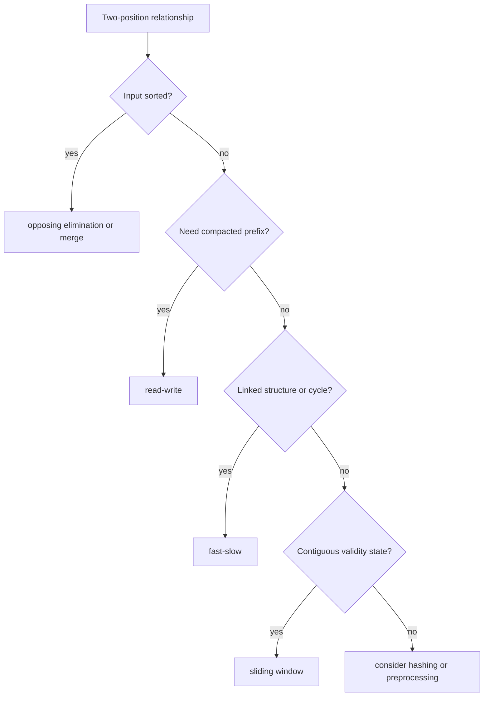

# Two Pointers: Interview Deep Dive

Two pointers reduce repeated work by exploiting order, monotonic movement, or a relationship between positions. The technique is a family of invariants, not one template.

## Learning Contract

You should be able to:

- recognize opposing, same-direction, read-write, merge, and fast-slow patterns;
- explain why a pointer move cannot discard a valid answer;
- derive linear cost from monotonic movement;
- handle duplicates and termination precisely;
- distinguish two pointers from sliding windows.

## Pattern Family

## Core Invariants

### Opposing Pointers

On a sorted array for target sum:

- if current sum is too small, every pair using the current left value and a smaller right value is also too small, so increment left;
- if current sum is too large, every pair using the current right value and a larger left value is also too large, so decrement right.

The sorted order proves each elimination.

### Read-Write

`[0, write)` is the final output prefix derived from `[0, read)`. This supports stable compaction, duplicate removal, and in-place filtering.

### Fast-Slow

If fast moves two edges and slow one edge, a cycle causes their relative positions modulo cycle length to meet. Without a cycle, fast reaches null.

### Merge

The output prefix contains the smallest processed elements from both sources. Compare current candidates and advance exactly the source that contributed.

## Worked Interview Trace: Three Sum

1. Sort the array.
2. Fix one index `i`.
3. Use opposing pointers on the suffix for `target - values[i]`.
4. After a match, advance past duplicates for all participating positions.
5. Skip duplicate fixed values.

Sorting costs `O(n log n)`; the fixed index times linear pointer scanning costs `O(n^2)` overall. Extra space depends on the sorting implementation and returned output.

## Model Interview Questions and Answers

### 1. Why does two-sum with opposing pointers require sorted input?

**Answer:** Pointer movement relies on monotonic order. If the sum is too small, increasing the left value is the only move that can increase it predictably. Without order, moving a boundary cannot safely eliminate candidates.

### 2. How is two pointers different from sliding window?

**Answer:** Sliding window maintains state for every element in a contiguous interval and adjusts validity. Two pointers more broadly relate positions and may inspect only boundary values, compact output, merge sequences, or detect cycles.

### 3. How do you prove a pointer move is safe?

**Answer:** Describe the entire set of candidates eliminated by that move and use the ordering or invariant to show none can satisfy the requirement. A pointer template without this elimination proof is incomplete.

### 4. How should duplicates be handled in result enumeration?

**Answer:** First define whether unique values, unique index tuples, or all multiplicities are required. Skip equal values only when doing so preserves that contract, usually after recording a value-based result.

### 5. Why does fast-slow cycle detection use constant space?

**Answer:** It stores only two references and advances them through the existing structure. The meeting proof uses relative movement modulo cycle length rather than a visited set.

### 6. Can two pointers be used on two different arrays?

**Answer:** Yes. Merge, intersection, and interval comparison often use one monotonic pointer per sorted input, yielding `O(m + n)` time because each pointer traverses its source once.

## Common Failure Modes

- Using opposing pointers on unsorted data without sorting or another monotonic property.
- Moving both pointers when only one elimination is justified.
- Skipping duplicates before recording a valid result.
- Comparing fast's next-next node without null checks.
- Losing stability in read-write compaction.
- Claiming `O(n)` after an uncounted sort.

## Practice Ladder

1. Pair sum in a sorted array.
2. Remove duplicates from a sorted array in place.
3. Merge two sorted arrays or interval lists.
4. Detect and locate a linked-list cycle.
5. Solve three-sum with unique value triples.
6. Compute trapped rain water with opposing maxima.

## Runnable Reference

Run [`TwoPointers.java`](https://github.com/vinayreddykalluri/SDE2-Interview-Handbook/blob/master/examples/java/src/main/java/io/github/vinayreddykalluri/interviewhandbook/codingfoundations/twopointers/TwoPointers.java). For each pointer update, annotate the candidates it eliminates.

## Sixty-Second Revision

- Identify the two pointer roles.
- State the order or invariant that justifies movement.
- Count total monotonic movement.
- Define duplicate semantics.
- Include sorting cost.
- Distinguish boundary comparison from window-state maintenance.

