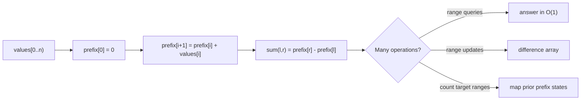

# Prefix Sums and Difference Arrays: Interview Deep Dive

Prefix techniques move repeated range work into preprocessing. They are especially powerful when many queries share the same immutable data or when a global range condition can be rewritten as a relation between two prefix states.

## Learning Contract

You should be able to:

- define exclusive and inclusive prefix conventions;
- derive range formulas instead of memorizing them;
- use prefix-frequency maps for subarray counting;
- apply difference arrays to batch range updates;
- extend reasoning to two dimensions;
- select numeric types that prevent cumulative overflow.

## Prefix Transformation



## Exclusive Prefix Convention

Create `prefix` of length `n + 1`:

```text
prefix[0] = 0
prefix[i + 1] = prefix[i] + values[i]
sum of values[l..r) = prefix[r] - prefix[l]
```

The leading zero represents the sum before consuming any element. It naturally handles ranges beginning at index zero and avoids special cases.

## Worked Interview Trace: Count Subarrays with Sum K

At index `i`, let current prefix sum be `p`. A prior prefix `q` forms a target-sum subarray when:

```text
p - q = k
q = p - k
```

Maintain frequencies of prefix sums already seen.

- Initialize frequency of zero to one.
- For each value, update current prefix.
- Add frequency of `current - k` to the answer.
- Then increment frequency of current.

The order matters: checking before inserting prevents counting an empty subarray unless explicitly desired. Expected time is `Theta(n)` and space is `Theta(n)`.

## Difference Arrays

To add `delta` to every index in inclusive range `[left, right]`:

- add `delta` at `difference[left]`;
- subtract `delta` at `difference[right + 1]` when that boundary exists;
- reconstruct final values with a prefix sum.

Each range update is `O(1)`, and one `O(n)` pass materializes all results. This is appropriate when updates are batched and point values are needed afterward, not when online queries require immediate answers.

## Two-Dimensional Prefixes

For a matrix, define a padded prefix grid. Rectangle sum uses inclusion-exclusion:

```text
rectangle = total to bottom-right
          - area above
          - area left
          + area removed twice at top-left
```

Draw the four regions during an interview; memorized signs are easy to reverse.

## Model Interview Questions and Answers

### 1. Why allocate a prefix array of length `n + 1`?

**Answer:** The zero prefix represents an empty consumed range, making `prefix[r] - prefix[l]` work for every half-open range including those starting at zero. It removes boundary branches.

### 2. When is prefix preprocessing worth it?

**Answer:** When the data is mostly immutable and multiple range queries justify `O(n)` preprocessing and `O(n)` storage. For one query, a direct scan may be simpler and equally asymptotic overall.

### 3. Why does the prefix-map solution work with negative numbers?

**Answer:** It does not rely on monotonic sums or boundary shrinking. It algebraically counts prior prefix states with the required difference, so arbitrary signs are valid.

### 4. What is the difference between a prefix sum and a difference array?

**Answer:** Prefix sums accelerate range queries on values. Difference arrays accelerate batched range updates by storing boundary changes, then reconstruct values with a prefix pass.

### 5. How do you avoid prefix overflow?

**Answer:** Choose a type based on maximum magnitude times element count. In Java, accumulate into `long` when `int` sums can overflow, and consider checked arithmetic if even `long` limits are reachable.

### 6. How do you derive the 2D rectangle formula?

**Answer:** Use inclusion-exclusion: take the prefix area through the rectangle's bottom-right, subtract the area above and left, then add back their overlap because it was subtracted twice.

## Common Failure Modes

- Mixing inclusive and exclusive prefix definitions.
- Forgetting initial frequency `0 -> 1`.
- Inserting current prefix before counting when empty ranges are disallowed.
- Using `int` for large cumulative sums or answer counts.
- Applying a difference array to an online query workload.
- Reversing inclusion-exclusion signs in 2D.

## Practice Ladder

1. Answer immutable range-sum queries.
2. Find an equilibrium index.
3. Count subarrays with sum `k` for arbitrary integers.
4. Count subarrays divisible by `k` using normalized remainders.
5. Apply many inclusive range increments with a difference array.
6. Answer 2D rectangle-sum queries.

## Runnable Reference

Study [`PrefixSum.java`](https://github.com/vinayreddykalluri/SDE2-Interview-Handbook/blob/master/examples/java/src/main/java/io/github/vinayreddykalluri/interviewhandbook/codingfoundations/prefixsum/PrefixSum.java). Add negative values, zero-length ranges, large sums, and repeated-prefix tests.

## Sixty-Second Revision

- Prefer an `n + 1` exclusive prefix.
- Derive range sums by subtraction.
- Prefix maps handle arbitrary signs.
- Seed the empty prefix.
- Difference arrays encode update boundaries.
- Widen cumulative values and result counts.

