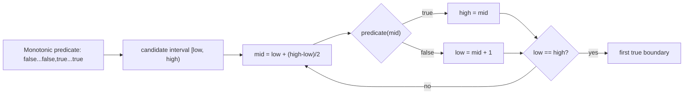

# Binary Search: Interview Deep Dive

Binary search is not merely "look in a sorted array." It is an invariant-driven method for locating a boundary in any monotonic predicate. Most bugs come from combining incompatible interval, midpoint, and update conventions.

## Learning Contract

You should be able to:

- write binary search from a declared interval invariant;
- implement exact search, lower bound, and upper bound;
- search a monotonic answer space;
- prove termination and logarithmic complexity;
- avoid midpoint overflow and infinite loops;
- separate predicate cost from iteration count.

## Boundary-Search Model



## Canonical Half-Open Lower Bound

Invariant: if the first value greater than or equal to target exists, its index is in `[low, high)`.

```text
low = 0
high = n
while low < high:
    mid = low + (high - low) / 2
    if values[mid] >= target:
        high = mid
    else:
        low = mid + 1
return low
```

The interval shrinks every iteration. Returning `n` is a valid insertion position when every value is smaller than target.

Upper bound changes the predicate to `values[mid] > target`. Exact search can be derived from lower bound by checking whether the returned index contains the target.

## Search on Answer

If a feasibility predicate changes monotonically with a candidate answer, search the candidate range.

Examples:

- minimum capacity that ships packages within `d` days;
- minimum speed that finishes work before a deadline;
- maximum minimum distance between placed items;
- smallest resource limit that satisfies all requests.

Total complexity is `O(log R * P)`, where `R` is answer-range size and `P` is the cost of one predicate evaluation. State both terms.

## Worked Interview Trace: First Occurrence

For `[1,2,2,2,5]` and target `2`:

- `[0,5)`, mid 2, value 2: keep mid, high becomes 2;
- `[0,2)`, mid 1, value 2: keep mid, high becomes 1;
- `[0,1)`, mid 0, value 1: discard through mid, low becomes 1;
- low equals high at 1.

The algorithm returns the first candidate satisfying `value >= target`.

## Model Interview Questions and Answers

### 1. What condition is required for binary search?

**Answer:** A monotonic decision boundary over the searched domain. Sorted values create such a boundary for comparisons, but answer-space feasibility predicates can also be monotonic without storing a sorted array.

### 2. Why use `low + (high - low) / 2`?

**Answer:** It avoids adding two potentially large bounds. The expression is also directly tied to interval width, which helps reason about shrinkage.

### 3. What is lower bound?

**Answer:** The first index whose value is not less than the target, or `n` if none exists. It is also the insertion position that preserves sorted order before any equal values.

### 4. How do you prevent infinite loops?

**Answer:** Choose updates that strictly reduce interval width under the declared convention. In `[low,high)` lower-bound search, true sets `high = mid` and false sets `low = mid + 1`. Never reuse `mid` on a branch without proving progress.

### 5. How do you validate answer-space monotonicity?

**Answer:** State the predicate and prove that once it becomes true, all larger candidates remain true, or the reverse. If feasibility can switch back and forth, binary search is invalid.

### 6. What is the real complexity of binary search on answer?

**Answer:** `O(log R)` predicate evaluations, not necessarily total time. If each predicate scans `n` elements, total time is `O(n log R)`. Include numeric range and predicate cost.

## Common Failure Modes

- Mixing inclusive and half-open updates.
- Returning a candidate without postcondition validation.
- Searching an answer predicate that is not monotonic.
- Ignoring duplicate semantics.
- Recomputing an expensive predicate unnecessarily.
- Overflowing answer bounds or predicate arithmetic.

## Practice Ladder

1. Exact search in a sorted array.
2. Lower and upper bound with duplicates.
3. Find a rotation pivot.
4. Search a rotated sorted array.
5. Find the minimum feasible capacity.
6. Binary-search a floating answer with an explicit precision and iteration policy.

## Runnable Reference

Use [`BinarySearch.java`](https://github.com/vinayreddykalluri/SDE2-Interview-Handbook/blob/master/examples/java/src/main/java/io/github/vinayreddykalluri/interviewhandbook/codingfoundations/binarysearch/BinarySearch.java). Test empty input, duplicates, insertion at both ends, and predicates whose answer is at each boundary.

## Sixty-Second Revision

- Search a monotonic boundary.
- Declare the interval.
- Use a safe midpoint.
- Make every branch shrink the interval.
- Define duplicate semantics.
- For answer search, include predicate cost and numeric range.

