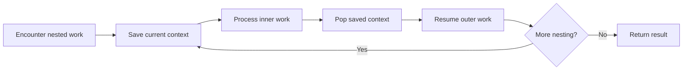

# Stacks and Recursion: Interview Deep Dive

A stack is the data structure behind nested work: function calls, parsing, backtracking, undo, and depth-first traversal. The interview skill is not merely calling `push` and `pop`; it is recognizing which unfinished work must be resumed in last-in, first-out order.

## Learning contract

After this chapter, you should be able to:

- explain what a recursive call frame stores;
- convert recursive DFS into an explicit-stack implementation;
- derive and prove a monotonic-stack solution;
- choose recursion, `ArrayDeque`, or a purpose-built parser state;
- state time and auxiliary-space complexity precisely;
- discuss stack overflow, malformed input, and production safeguards.

## 1. The unifying model: suspended work

A stack stores work that started but cannot finish yet. The top entry is the next suspended task to resume.



A recursive call uses the runtime call stack. An iterative solution uses an explicit stack. The algorithmic dependency is the same; only the representation changes.

## 2. What a recursive frame contains

A call frame typically contains:

- parameters and local variables;
- the return address;
- bookkeeping needed by the runtime;
- the point at which execution resumes after a child call.

For a tree traversal, the hidden state is often `(node, phase)`. The phase tells whether the algorithm is entering the node, returning from the left subtree, or returning from the right subtree. This observation makes recursion-to-iteration conversion mechanical.

### Recursive versus explicit stack

| Concern | Recursion | Explicit stack |
|---|---|---|
| Readability | Often closest to a recursive definition | More control, more bookkeeping |
| Depth limit | Limited by thread stack | Limited mainly by heap |
| Frame contents | Implicit | Must be modeled explicitly |
| Traversal order | Determined by call order | Determined by push order |
| Early pause/resume | Awkward | Natural for iterators and workflows |

## 3. Converting DFS to iteration

For preorder traversal, push the root, repeatedly pop a node, process it, and push children in reverse desired order. If left must be visited before right, push right first because the stack is LIFO.

```java
static void preorder(Node root) {
    if (root == null) return;

    Deque<Node> stack = new ArrayDeque<>();
    stack.push(root);

    while (!stack.isEmpty()) {
        Node node = stack.pop();
        visit(node);
        if (node.right != null) stack.push(node.right);
        if (node.left != null) stack.push(node.left);
    }
}
```

**Invariant:** immediately before each iteration, the stack contains exactly the discovered but unprocessed nodes, ordered so the next required node is on top.

Both recursive and iterative DFS take `O(V + E)` on a graph represented by adjacency lists. Their auxiliary space is `O(V)` in the worst case, although a balanced tree recursion may use only `O(log V)` depth.

## 4. Monotonic stacks

A monotonic stack stores candidates in increasing or decreasing order. When a new value makes an older candidate impossible to use later, remove that candidate immediately.

### Worked trace: next greater element

Input: `[2, 1, 2, 4, 3]`. Keep indices whose next greater value is unresolved.

| Current index/value | Stack before | Resolution | Stack after |
|---|---|---|---|
| `0 / 2` | `[]` | none | `[0]` |
| `1 / 1` | `[0]` | none | `[0, 1]` |
| `2 / 2` | `[0, 1]` | index `1 -> 2` | `[0, 2]` |
| `3 / 4` | `[0, 2]` | indices `2 -> 4`, `0 -> 4` | `[3]` |
| `4 / 3` | `[3]` | none | `[3, 4]` |

```java
static int[] nextGreater(int[] values) {
    int[] answer = new int[values.length];
    Arrays.fill(answer, -1);
    Deque<Integer> stack = new ArrayDeque<>();

    for (int i = 0; i < values.length; i++) {
        while (!stack.isEmpty() && values[stack.peek()] < values[i]) {
            answer[stack.pop()] = values[i];
        }
        stack.push(i);
    }
    return answer;
}
```

The nested `while` loop is still linear: each index is pushed once and popped at most once. This is an aggregate-analysis proof, not a guess based on syntax.

## 5. Parsing and delimiter matching

A delimiter stack must validate more than equal counts. It must preserve nesting order.

```java
static boolean balanced(String text) {
    Deque<Character> opens = new ArrayDeque<>();
    for (char ch : text.toCharArray()) {
        if (ch == '(' || ch == '[' || ch == '{') {
            opens.push(ch);
        } else if (ch == ')' || ch == ']' || ch == '}') {
            if (opens.isEmpty() || !matches(opens.pop(), ch)) return false;
        }
    }
    return opens.isEmpty();
}
```

**Invariant:** the stack contains unmatched opening delimiters in the exact order in which they must be closed.

## 6. Interview questions and model answers

### Q1. Does replacing recursion with a stack improve asymptotic space?

Usually no. Both representations store one unit of state per active depth level. The explicit stack avoids a fixed call-stack limit and lets you minimize frame state, but worst-case auxiliary space often remains `O(depth)`.

### Q2. How do you convert a recursive algorithm to iteration?

Identify everything needed after a child call returns, place that data in an explicit frame, push frames in reverse execution order, and preserve the recursive base case as the iterative termination rule.

### Q3. Why is a monotonic-stack algorithm commonly `O(n)` despite a nested loop?

Charge work to elements rather than iterations. Every element is pushed once and can be popped only once, so total stack operations are at most proportional to `2n`.

### Q4. When is recursion unsafe in production?

When input controls depth, depth can be linear, or the runtime has a small stack. An adversarial linked list or skewed tree can trigger stack overflow. Use an explicit stack, enforce a depth limit, or reject malformed structures.

### Q5. Why prefer `ArrayDeque` over Java's legacy `Stack`?

`ArrayDeque` provides the `Deque` API, avoids legacy `Vector` synchronization overhead, and clearly supports stack operations through `push`, `pop`, and `peek`. It does not permit `null`, which also avoids ambiguous sentinel behavior.

### Q6. What is the key correctness condition in expression parsing?

Operator application must respect precedence, associativity, and parenthesis boundaries. State the operator-stack invariant explicitly: operators remaining on the stack cannot yet be emitted because a higher-priority or nested expression is still unresolved.

## 7. Common failure modes

- pushing DFS children in the wrong order;
- storing values when indices are required for distance or boundaries;
- using `<` where `<=` is required in duplicate-handling rules;
- forgetting the final unmatched entries in a delimiter stack;
- claiming `O(1)` space for recursion because no collection is allocated;
- recursively processing untrusted depth without a guard.

## 8. Practice ladder

1. Validate brackets and report the first invalid position.
2. Implement iterative preorder, inorder, and postorder traversal.
3. Solve next greater element and daily temperatures.
4. Evaluate reverse Polish notation and then parse infix expressions.
5. Solve largest rectangle in a histogram and prove the boundary rule.
6. Design a depth-limited parser that returns a useful failure reason.

## Runnable reference

See [`StackPatterns.java`](https://github.com/vinayreddykalluri/SDE2-Interview-Handbook/blob/master/examples/java/src/main/java/io/github/vinayreddykalluri/interviewhandbook/codingfoundations/stacks/StackPatterns.java) for executable stack patterns.

## 60-second revision

- A stack represents unfinished nested work.
- Recursion hides frames; iteration makes them explicit.
- Push children in reverse desired visitation order.
- A monotonic stack deletes candidates that can never become answers.
- Linear time follows because each item enters and leaves at most once.
- Always count call-stack space and protect untrusted recursion depth.

