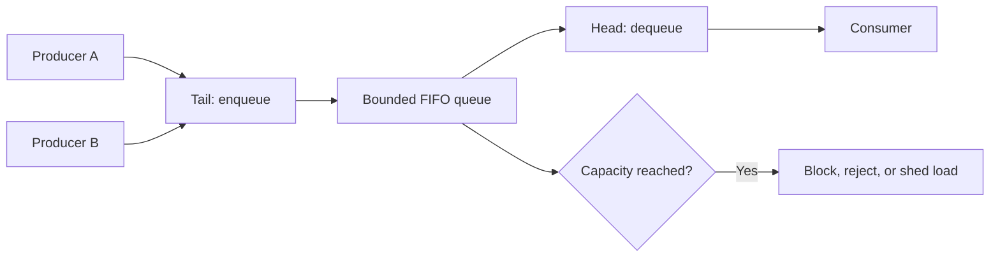

# Queues and Deques: Interview Deep Dive

Queues model work that must be processed in arrival order. Deques generalize that model by supporting both ends, enabling monotonic-window algorithms, 0-1 BFS, task scheduling, and efficient buffering.

## Learning contract

After this chapter, you should be able to:

- connect FIFO order to breadth-first exploration;
- implement a correct circular buffer;
- derive a monotonic-deque algorithm and its linear bound;
- distinguish queue size, graph level, and processing time;
- explain bounded queues and backpressure;
- select an appropriate Java queue implementation.

## 1. Queue semantics

A queue promises that an item inserted earlier is removed earlier, subject to the implementation's concurrency and priority rules.



The interface matters more than the container name:

- `offer`/`poll` return status or `null` rather than throwing on ordinary capacity/empty conditions;
- `add`/`remove` may throw;
- `put`/`take` on blocking queues can wait and must participate in interruption and shutdown policy.

## 2. Why BFS needs a queue

In an unweighted graph, BFS discovers vertices in nondecreasing distance from the source. FIFO order ensures every vertex at distance `d` is expanded before any vertex at distance `d + 1` is expanded.

```java
static int shortestHops(List<List<Integer>> graph, int source, int target) {
    int[] distance = new int[graph.size()];
    Arrays.fill(distance, -1);
    Queue<Integer> queue = new ArrayDeque<>();

    distance[source] = 0;
    queue.offer(source);
    while (!queue.isEmpty()) {
        int node = queue.poll();
        if (node == target) return distance[node];
        for (int next : graph.get(node)) {
            if (distance[next] == -1) {
                distance[next] = distance[node] + 1;
                queue.offer(next);
            }
        }
    }
    return -1;
}
```

Mark a vertex when enqueuing, not when dequeuing. Otherwise, multiple parents may enqueue it repeatedly and inflate both work and memory.

## 3. Circular-buffer reasoning

A fixed-capacity ring reuses an array by wrapping indices with modulo arithmetic.

```text
head = index of next element to remove
tail = index where next element is inserted
size = number of live elements
next(i) = (i + 1) % capacity
```

Using only `head == tail` is ambiguous: it can mean empty or full. Resolve this by storing `size`, reserving one slot, or maintaining an explicit full flag.

```java
final class IntRing {
    private final int[] data;
    private int head;
    private int tail;
    private int size;

    IntRing(int capacity) {
        if (capacity <= 0) throw new IllegalArgumentException("capacity");
        data = new int[capacity];
    }

    boolean offer(int value) {
        if (size == data.length) return false;
        data[tail] = value;
        tail = (tail + 1) % data.length;
        size++;
        return true;
    }

    int poll() {
        if (size == 0) throw new NoSuchElementException();
        int value = data[head];
        head = (head + 1) % data.length;
        size--;
        return value;
    }
}
```

**Invariant:** `0 <= size <= capacity`, and the live logical sequence starts at `head` and spans exactly `size` wrapped positions.

## 4. Monotonic deque: sliding-window maximum

Store indices in decreasing value order. The front is always the maximum for the current window.

For input `[1, 3, -1, -3, 5, 3, 6, 7]` and window `3`:

| Window | Deque indices after cleanup | Maximum |
|---|---|---|
| `[1, 3, -1]` | `[1, 2]` | `3` |
| `[3, -1, -3]` | `[1, 2, 3]` | `3` |
| `[-1, -3, 5]` | `[4]` | `5` |
| `[-3, 5, 3]` | `[4, 5]` | `5` |
| `[5, 3, 6]` | `[6]` | `6` |
| `[3, 6, 7]` | `[7]` | `7` |

```java
static int[] maxWindows(int[] values, int k) {
    if (k <= 0 || k > values.length) throw new IllegalArgumentException("k");
    int[] answer = new int[values.length - k + 1];
    Deque<Integer> deque = new ArrayDeque<>();

    for (int right = 0; right < values.length; right++) {
        while (!deque.isEmpty() && deque.peekFirst() <= right - k) deque.removeFirst();
        while (!deque.isEmpty() && values[deque.peekLast()] <= values[right]) deque.removeLast();
        deque.addLast(right);
        if (right >= k - 1) answer[right - k + 1] = values[deque.peekFirst()];
    }
    return answer;
}
```

Each index is added once and removed at most once from each end, so total time is `O(n)`.

## 5. Production queues and backpressure

An unbounded queue converts overload into memory growth and latency. A bounded queue makes capacity explicit. When full, a system must choose a policy:

| Policy | Benefit | Cost |
|---|---|---|
| Block producer | Preserves work | Propagates latency and may deadlock |
| Reject | Keeps latency bounded | Caller must retry or fail |
| Drop newest/oldest | Protects service | Loses data |
| Coalesce | Reduces redundant work | Only valid for replaceable updates |

Queue length is a symptom, not a complete health metric. Also observe arrival rate, service rate, oldest-item age, rejection count, and consumer saturation.

## 6. Interview questions and model answers

### Q1. Why does BFS find shortest paths?

For unweighted or equal-weight edges, FIFO expansion processes vertices by distance layers. The first discovery of a vertex therefore uses the fewest edges. This claim does not hold for arbitrary weighted edges.

### Q2. Queue or deque: how do you choose?

Use a queue when only FIFO semantics are needed. Use a deque when the algorithm inserts or removes at both ends, such as monotonic windows or 0-1 BFS. Program to the narrowest interface that expresses the invariant.

### Q3. How do you distinguish full and empty in a ring buffer?

Track the current size, reserve one array slot, or maintain a separate full bit. Tracking size uses all slots and makes the invariant explicit, at the cost of one additional field.

### Q4. Why is a monotonic deque linear?

Although each iteration contains cleanup loops, every index enters once and permanently leaves once. Aggregate deque operations are `O(n)`.

### Q5. What does backpressure solve?

It prevents producers from creating work faster than downstream components can safely absorb. A bounded queue plus an explicit full policy turns hidden memory and latency growth into controlled behavior.

### Q6. Is a concurrent queue enough to make a workflow thread-safe?

No. It makes individual queue operations safe. Multi-step protocols, item ownership, retries, idempotency, shutdown, and visibility of state outside the queue still need design.

## 7. Common failure modes

- marking BFS nodes visited only after dequeue;
- mixing node count and level count in level-order traversal;
- storing values instead of indices in a window deque;
- forgetting to evict expired indices before reading the maximum;
- using `LinkedList` by habit when `ArrayDeque` is sufficient;
- allowing unbounded queue growth without an overload policy.

## 8. Practice ladder

1. Implement a queue using two stacks.
2. Implement and test a fixed-capacity ring buffer mentally across wraparound.
3. Perform tree level-order traversal with level boundaries.
4. Solve shortest path in a binary matrix.
5. Solve sliding-window maximum with a monotonic deque.
6. Design a bounded worker queue with shutdown and rejection semantics.

## Runnable reference

See [`QueuePatterns.java`](https://github.com/vinayreddykalluri/SDE2-Interview-Handbook/blob/master/examples/java/src/main/java/io/github/vinayreddykalluri/interviewhandbook/codingfoundations/queues/QueuePatterns.java) for executable queue and deque patterns.

## 60-second revision

- FIFO order creates BFS distance layers.
- Mark graph nodes when enqueuing.
- A ring needs an unambiguous full/empty rule.
- Monotonic deques retain only candidates that can still win.
- Each index enters and leaves once, yielding `O(n)` time.
- Bounded queues need an explicit overload and shutdown policy.

