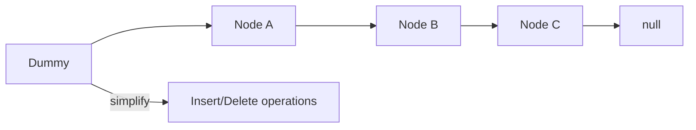

# Chapter 1: Linked List Patterns and Pointer Safety

## Why This Matters

Interviews test list manipulation as pointer discipline problems. One off-by-one or missed link can break the entire structure.

## Learning Objectives

- Traverse, insert, and delete nodes in O(1)/O(n) contexts.
- Detect cycles and palindromes.
- Reverse list iteratively and recursively.
- Use dummy nodes to simplify edge cases.

## Core Concept

A singly linked list stores value + next pointer. Random access is O(n), but insert/delete at known positions can be O(1).

Typical interview primitives:
- `slow`/`fast` pointers.
- reversing with `prev, cur, nxt`.
- dummy sentinel for head mutations.

## Internal Working

1. Preserve next pointers before reassignment.
2. Update links in deterministic order.
3. Return new head when changes occur at beginning.

## Architecture or Memory Diagram

## Code Example

[Code Example 1 in detail (external file)](https://github.com/vinayreddykalluri/SDE2-Interview-Handbook/blob/master/examples/java/src/main/java/io/github/vinayreddykalluri/interviewhandbook/codingfoundations/linkedlists/ListPatterns.java)

## Step-by-Step Execution

1. Start with `prev = null`, `cur = head`.
2. Save `cur.next`.
3. Redirect `cur.next` to `prev`.
4. Move both pointers forward.
5. Return `prev` as new head.

## Interviewer Perspective

Questions often include:
- "How do you avoid losing the list when reversing?"
- "Why dummy node helps for removing head?"

Explain pointer snapshots and transition invariants.

## Common Mistakes

- Not storing `nxt` before reassignment.
- Null pointer access on boundary operations.
- Using recursive reversal for very large lists causing stack overflow.

## Production Perspective

Pointer-heavy code appears in memory pools, intrusive lists, and cache-efficient internal data structures.

## Must Know for DSA

Caring about links and boundaries is essential for safe pointer manipulation in whiteboard rounds.

## Interview Questions and Answers

- **Q: Why reverse in-place?**
  - **Answer:** O(1) auxiliary space and constant-time link updates.
- **Q: Why dummy node?**
  - **Answer:** simplifies head/tail insertion and deletion.
- **Q: Is cycle detection O(1) space?**
  - **Answer:** yes with tortoise-hare.

## Practice Exercises

1. Find middle node with slow/fast pointers.
2. Detect cycle start node.
3. Remove nth node from end with one pass.

## Revision Checklist

- [ ] Use temporary pointers before mutation.
- [ ] Keep invariant on reversed segment.
- [ ] Handle null/one-node/base cases.
- [ ] Explain O(n) traversal cost.

## One-Page Summary

Linked-list questions are about pointer correctness first, complexity second. A disciplined pointer flow avoids class of subtle failures.
