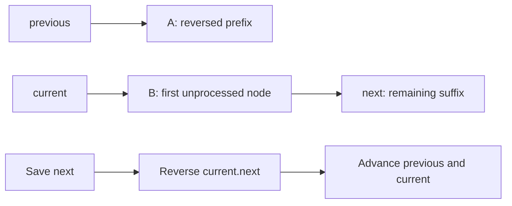

# Linked Lists: Interview Deep Dive

Linked-list questions test pointer ownership and mutation discipline. The hard part is rarely traversal; it is preserving access to the unprocessed suffix while reconnecting nodes without losing, duplicating, or cycling them.

## Learning contract

After this chapter, you should be able to:

- reason about nodes, references, and ownership separately from values;
- use sentinel nodes to remove boundary special cases;
- derive reversal, merge, cycle, and midpoint algorithms;
- state pointer invariants before mutation;
- compare linked and contiguous storage realistically;
- identify aliasing and concurrency risks in production code.

## 1. The pointer-mutation discipline

Before changing a link, save every reference needed to reach the remaining structure.



A useful mutation checklist is:

1. Name the segments of the structure.
2. State which reference owns access to each segment.
3. Save the next required reference.
4. Mutate one pointer.
5. Re-establish the invariant before continuing.

## 2. Reversal from the invariant

At loop entry:

- `previous` is the head of the fully reversed prefix;
- `current` is the first node of the untouched suffix;
- together those two segments contain every original node exactly once.

```java
static Node reverse(Node head) {
    Node previous = null;
    Node current = head;

    while (current != null) {
        Node next = current.next;  // preserve suffix ownership
        current.next = previous;  // move one node to reversed prefix
        previous = current;
        current = next;
    }
    return previous;
}
```

### Worked trace: `1 -> 2 -> 3`

| Step | `previous` | `current` | Untouched suffix |
|---|---|---|---|
| Start | `null` | `1` | `1 -> 2 -> 3` |
| 1 | `1 -> null` | `2` | `2 -> 3` |
| 2 | `2 -> 1` | `3` | `3` |
| 3 | `3 -> 2 -> 1` | `null` | empty |

The algorithm is `O(n)` time and `O(1)` auxiliary space. Returning `previous`, not the original `head`, is essential.

## 3. Sentinel nodes

A sentinel or dummy node is a temporary predecessor of the real head. It converts operations at the head into ordinary operations after a predecessor.

```java
static Node removeValue(Node head, int target) {
    Node dummy = new Node(0, head);
    Node previous = dummy;
    Node current = head;

    while (current != null) {
        if (current.value == target) previous.next = current.next;
        else previous = current;
        current = current.next;
    }
    return dummy.next;
}
```

The sentinel reduces branches, but it does not change asymptotic complexity. Its value must never be treated as user data.

## 4. Fast and slow pointers

Two references moving at different speeds encode relative position without storing indices.

| Pattern | Slow speed | Fast speed | Result |
|---|---:|---:|---|
| Middle | 1 | 2 | Slow reaches middle |
| Cycle detection | 1 | 2 | Pointers meet inside a cycle |
| Kth from end | 1 after gap | 1 | Fixed distance maintained |

For Floyd cycle detection, if a cycle exists, the faster pointer gains one node per iteration relative to the slower pointer, so their positions must eventually coincide modulo cycle length.

To find the cycle entrance after a meeting, reset one pointer to the head and move both one step at a time; they meet at the entrance. The proof follows from decomposing traveled distance into the non-cycle prefix and whole cycle lengths.

## 5. Merge as a reusable primitive

Merging two sorted lists is pointer splicing, not value copying. Maintain a tail reference to the already-correct output prefix.

```java
static Node merge(Node left, Node right) {
    Node dummy = new Node(0, null);
    Node tail = dummy;

    while (left != null && right != null) {
        if (left.value <= right.value) {
            tail.next = left;
            left = left.next;
        } else {
            tail.next = right;
            right = right.next;
        }
        tail = tail.next;
    }
    tail.next = left != null ? left : right;
    return dummy.next;
}
```

**Invariant:** `dummy.next ... tail` is sorted and contains exactly the consumed nodes; `left` and `right` point to the unconsumed sorted suffixes.

## 6. Interview questions and model answers

### Q1. Why is random access `O(n)` in a linked list?

Nodes are not guaranteed to be contiguous and do not encode an address formula for index `i`. Reaching the ith node requires following `i` links from a known reference.

### Q2. When does a sentinel node help?

When insertion or deletion may change the head, or when output is built incrementally. It gives the first real node a predecessor and unifies boundary behavior with the general case.

### Q3. How do you prove iterative reversal is correct?

Use the two-segment invariant: the reversed prefix and untouched suffix partition the original nodes. Each iteration moves exactly one node from suffix to prefix without losing the saved successor. At termination, the suffix is empty.

### Q4. Why does Floyd's cycle algorithm use constant space?

It stores only a fixed number of references. It detects repetition through relative motion rather than recording every visited node in a set.

### Q5. How do you find the intersection of two acyclic lists?

Either align pointers after measuring lengths, or let each pointer switch to the other list's head at its own end. Each then travels the same combined distance, meeting at the shared node or at `null`. Compare node identity, not value.

### Q6. Why can linked lists perform poorly despite `O(1)` insertion?

Finding the insertion point may still cost `O(n)`. Nodes add allocation and pointer overhead, have poor cache locality, and increase garbage-collection pressure. Arrays often win for traversal-heavy workloads.

## 7. Production hazards

- A node may be aliased by multiple owners; mutation can surprise another caller.
- Reusing input nodes may violate an API's immutability expectation.
- Concurrent mutation requires more than marking `next` volatile.
- Recursive processing can overflow on a long list.
- Logging a cyclic list without a limit can loop forever.
- Object-per-node storage can dominate payload memory.

## 8. Common failure modes

- overwriting `current.next` before saving it;
- returning the old head after reversal;
- comparing values instead of reference identity for intersection;
- advancing the predecessor after deleting the current node;
- dereferencing `fast.next.next` without null guards;
- creating an accidental cycle while reconnecting sublists.

## 9. Practice ladder

1. Reverse a list iteratively and recursively.
2. Remove all matching nodes using a sentinel.
3. Find the middle and kth node from the end.
4. Detect a cycle and return its entrance.
5. Merge two lists, then implement merge sort on a list.
6. Reverse nodes in groups of `k` with a written segment invariant.

## Runnable reference

See [`ListPatterns.java`](https://github.com/vinayreddykalluri/SDE2-Interview-Handbook/blob/master/examples/java/src/main/java/io/github/vinayreddykalluri/interviewhandbook/codingfoundations/linkedlists/ListPatterns.java) for executable linked-list patterns.

## 60-second revision

- Save access to the suffix before mutating a link.
- Describe lists as owned segments, not just arrows.
- Sentinels eliminate head-specific branches.
- Fast/slow pointers encode relative distance.
- Compare node identity for structural questions.
- `O(1)` insertion only applies when the position is already known.

