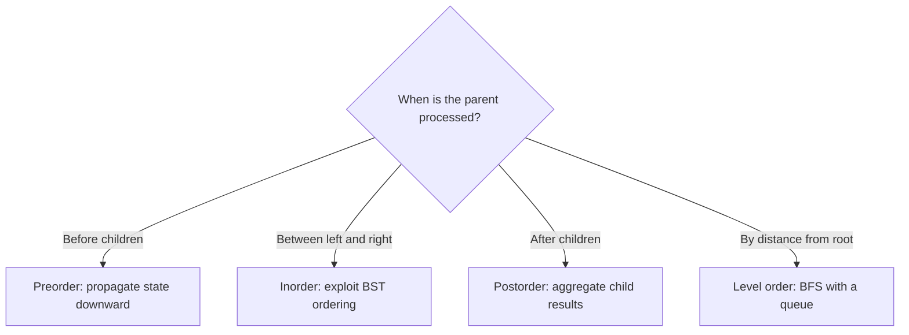

# Trees: Interview Deep Dive

Tree questions are tests of recursive contract design. A strong solution defines exactly what each subtree call returns, combines child results locally, and separates structural facts from global mutable state.

## Learning contract

After this chapter, you should be able to:

- select preorder, inorder, postorder, or level-order traversal intentionally;
- define a minimal recursive return contract;
- distinguish height, depth, diameter, and balance;
- validate a BST with range semantics;
- reason about skewed-tree time and stack space;
- discuss serialization, duplicate policy, and production limits.

## 1. Choose traversal from dependency order

Traversal order is a dependency decision, not a memorization exercise.



| Need | Natural traversal | Reason |
|---|---|---|
| Copy or serialize shape | Preorder | Emit parent before descendants |
| Sorted BST values | Inorder | Left, node, right follows ordering |
| Height, size, balance, diameter | Postorder | Parent depends on child results |
| Minimum depth or levels | BFS | Processes nodes by depth |

## 2. Recursive contracts

Before writing code, finish this sentence:

> For a node `x`, `solve(x)` returns ...

Examples:

- height: the number of nodes on the longest downward path starting at `x`;
- balance: either subtree height or a sentinel meaning unbalanced;
- path sum: the best downward path that must start at `x`;
- BST validation: whether every value in the subtree lies within inherited bounds.

A return value should contain exactly what the parent needs. Avoid repeatedly recomputing height inside a separate balance check, which turns an `O(n)` postorder solution into `O(n^2)` on a skewed tree.

## 3. Worked example: balanced tree in one pass

Return height for a balanced subtree and `-1` for an unbalanced subtree.

```java
static boolean isBalanced(Node root) {
    return balancedHeight(root) != -1;
}

static int balancedHeight(Node node) {
    if (node == null) return 0;

    int left = balancedHeight(node.left);
    if (left == -1) return -1;

    int right = balancedHeight(node.right);
    if (right == -1) return -1;

    if (Math.abs(left - right) > 1) return -1;
    return 1 + Math.max(left, right);
}
```

**Contract:** `balancedHeight(node)` returns the subtree height if balanced; otherwise it returns `-1`.

**Correctness:** child calls establish the contract for both subtrees. The current node is balanced exactly when both children are balanced and their heights differ by at most one.

**Complexity:** each node is processed once, so time is `O(n)`. Call-stack space is `O(h)`, where `h` is tree height: `O(log n)` for a balanced tree and `O(n)` for a skewed tree.

## 4. BST validation requires inherited bounds

Checking only `node.left.value < node.value < node.right.value` is insufficient. A descendant can violate an ancestor's constraint.

```java
static boolean validBst(Node node, long low, long high) {
    if (node == null) return true;
    if (node.value <= low || node.value >= high) return false;
    return validBst(node.left, low, node.value)
        && validBst(node.right, node.value, high);
}
```

Using `long` bounds avoids overflow tricks around `Integer.MIN_VALUE` and `Integer.MAX_VALUE`. The inequality must match the declared duplicate policy. A production tree API must state whether duplicates are rejected, counted, or consistently placed on one side.

## 5. Diameter and path-state separation

Tree diameter is the longest path between any two nodes. At each node:

- the value returned upward is one downward height;
- the candidate diameter passing through the node combines left and right heights.

This is a common pattern: **return one extendable path; update a global or aggregate with a complete path**. Keep node-count and edge-count definitions consistent. If null height is `0` and leaf height is `1`, diameter in edges is `leftHeight + rightHeight`; diameter in nodes adds one.

## 6. Iterative traversal and frame state

Preorder needs only nodes on an explicit stack. Iterative postorder needs to know whether a frame is entering or exiting a node, or it needs a `lastVisited` reference. The additional state is the iterative representation of the program counter hidden in recursive frames.

Use iteration when depth is untrusted, when traversal must pause and resume, or when the runtime stack limit is a practical risk.

## 7. Interview questions and model answers

### Q1. What is the difference between depth and height?

Depth measures distance from the root to a node. Height measures the longest downward distance from a node to a leaf. State whether distances count edges or nodes before coding.

### Q2. Why is postorder natural for balance or diameter?

The parent's answer depends on completed results from both children. Postorder computes children first, then combines their heights or path summaries at the parent.

### Q3. Why is local-child checking insufficient for BST validation?

BST ordering applies to every descendant: all left-subtree values must satisfy the ancestor's lower and upper bounds. Passing inherited ranges enforces the complete constraint.

### Q4. What is tree traversal space complexity?

DFS uses `O(h)` active stack space. This is `O(log n)` only for balanced trees and `O(n)` for a skewed tree. BFS uses `O(w)`, where `w` is maximum width, which can also be `O(n)`.

### Q5. How do you find lowest common ancestor?

In a general binary tree, a postorder call reports whether targets occur below; the first node whose branches collectively contain both is the LCA. In a BST, ordering can direct the search left, right, or identify the split point.

### Q6. What makes serialization unambiguous?

Include structure markers for missing children or use a traversal plus sufficient reconstruction rules. Values alone are not enough for arbitrary binary trees. Also define escaping, versioning, bounds, and malformed-input behavior.

## 8. Common failure modes

- assuming every tree is balanced when reporting stack space;
- mixing edge-based and node-based height definitions;
- recomputing subtree height and causing quadratic time;
- validating only immediate BST children;
- using global mutable fields that are not reset between calls;
- omitting null markers during general-tree serialization.

## 9. Practice ladder

1. Implement all four traversal orders.
2. Compute size, height, and minimum depth with stated definitions.
3. Validate a BST and find its kth smallest value.
4. Check balance in one pass and compute diameter.
5. Find LCA in a binary tree and in a BST.
6. Serialize and deserialize a tree with malformed-input checks.

## Runnable reference

See [`TreePatterns.java`](https://github.com/vinayreddykalluri/SDE2-Interview-Handbook/blob/master/examples/java/src/main/java/io/github/vinayreddykalluri/interviewhandbook/codingfoundations/trees/TreePatterns.java) for executable tree patterns.

## 60-second revision

- Choose traversal by dependency order.
- Define the subtree return contract before coding.
- Postorder aggregates child facts.
- BST validation propagates ancestor bounds.
- DFS space is `O(height)`, not automatically `O(log n)`.
- State node-versus-edge conventions and duplicate policy.

