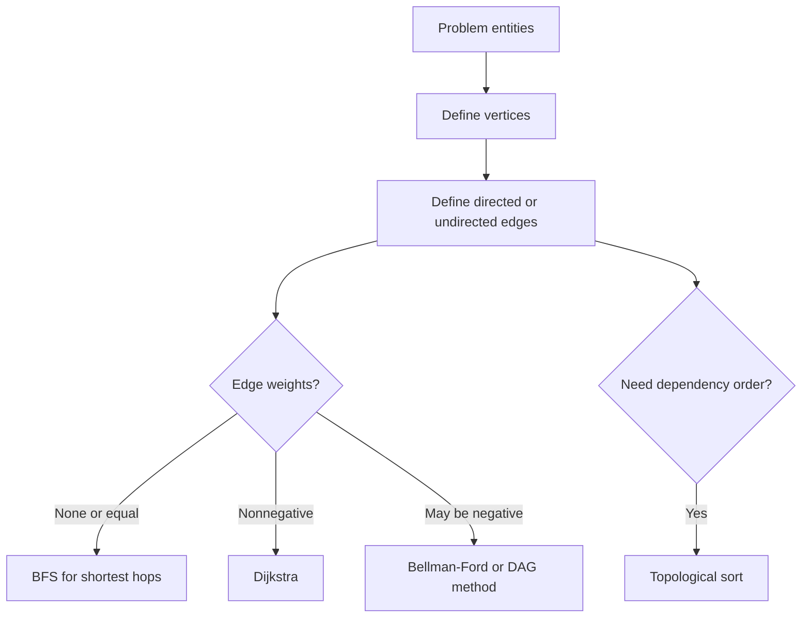

# Graphs: Interview Deep Dive

Graph questions become manageable when you separate four decisions: representation, traversal frontier, visited state, and the meaning of an edge. Most mistakes come from choosing one of these implicitly.

## Learning contract

After this chapter, you should be able to:

- choose adjacency lists, matrices, or implicit neighbors;
- derive BFS and DFS from their frontier semantics;
- handle disconnected, directed, and cyclic graphs correctly;
- detect cycles and produce topological order;
- select BFS, Dijkstra, Bellman-Ford, or union-find by constraints;
- reason about complexity in terms of vertices and edges.

## 1. Model the graph first

Ask what vertices and edges represent before selecting an algorithm.



### Representation trade-offs

| Representation | Space | Enumerate neighbors | Test edge | Best fit |
|---|---:|---:|---:|---|
| Adjacency list | `O(V + E)` | `O(degree(v))` | Usually `O(degree(v))` | Sparse graphs |
| Adjacency matrix | `O(V^2)` | `O(V)` | `O(1)` | Dense or small graphs |
| Edge list | `O(E)` | `O(E)` | `O(E)` | Sorting edges, Bellman-Ford |
| Implicit | Problem-dependent | Generate on demand | Problem-dependent | Grids, words, states |

For an undirected adjacency list, each edge normally appears twice, but asymptotic storage remains `O(V + E)`.

## 2. BFS and DFS are frontier policies

Both algorithms repeatedly remove discovered work, process it, and add undiscovered neighbors.

- BFS frontier: queue; explores by nondecreasing hop distance.
- DFS frontier: call stack or explicit stack; follows one branch deeply.

```java
static int[] bfsDistances(List<List<Integer>> graph, int source) {
    int[] distance = new int[graph.size()];
    Arrays.fill(distance, -1);
    Queue<Integer> queue = new ArrayDeque<>();
    distance[source] = 0;
    queue.offer(source);

    while (!queue.isEmpty()) {
        int node = queue.poll();
        for (int next : graph.get(node)) {
            if (distance[next] == -1) {
                distance[next] = distance[node] + 1;
                queue.offer(next);
            }
        }
    }
    return distance;
}
```

With adjacency lists, either traversal is `O(V + E)` if each vertex is marked once and each edge is examined a constant number of times.

## 3. Visited state is sometimes more than a boolean

Directed cycle detection needs three states:

- white: undiscovered;
- gray: active in the current DFS path;
- black: fully processed.

An edge to a gray node is a back edge and proves a directed cycle. An edge to a black node does not.

For undirected DFS, the immediate parent edge is expected and must not be treated as a cycle. A visited neighbor different from the parent indicates a cycle.

Other problems may require state keyed by `(vertex, extraState)`, such as `(cell, remainingObstacleEliminations)`. Marking only the vertex would merge meaningfully different paths and can discard the optimal solution.

## 4. Topological sorting

A topological order exists only for a directed acyclic graph.

### Kahn's algorithm

1. Compute every vertex's indegree.
2. Enqueue all zero-indegree vertices.
3. Remove one, append it to the order, and decrement outgoing neighbors.
4. Enqueue neighbors whose indegree becomes zero.
5. If fewer than `V` vertices are produced, a cycle exists.

```java
static List<Integer> topologicalOrder(List<List<Integer>> graph) {
    int[] indegree = new int[graph.size()];
    for (List<Integer> edges : graph) {
        for (int next : edges) indegree[next]++;
    }

    Queue<Integer> ready = new ArrayDeque<>();
    for (int node = 0; node < indegree.length; node++) {
        if (indegree[node] == 0) ready.offer(node);
    }

    List<Integer> order = new ArrayList<>();
    while (!ready.isEmpty()) {
        int node = ready.poll();
        order.add(node);
        for (int next : graph.get(node)) {
            if (--indegree[next] == 0) ready.offer(next);
        }
    }
    return order.size() == graph.size() ? order : List.of();
}
```

**Invariant:** the ready queue contains exactly the unprocessed vertices with no incoming edge from another unprocessed vertex.

## 5. Shortest-path decision table

| Edge model | Algorithm | Typical complexity |
|---|---|---|
| Unweighted/equal weight | BFS | `O(V + E)` |
| Weights `0` or `1` | 0-1 BFS with deque | `O(V + E)` |
| Nonnegative weights | Dijkstra with heap | `O((V + E) log V)` |
| Negative edges | Bellman-Ford | `O(VE)` |
| DAG with weights | Topological relaxation | `O(V + E)` |

Dijkstra's greedy finalization fails with negative edges because a later path can reduce the distance of a supposedly finalized vertex.

## 6. Union-find for connectivity

Disjoint-set union supports repeated component merges and connectivity checks. With path compression and union by rank or size, a sequence of operations has near-constant amortized cost, conventionally written `O(alpha(V))` per operation.

Use it for offline connectivity and Kruskal's minimum spanning tree. It does not naturally recover paths, direct traversal order, or directed reachability.

## 7. Interview questions and model answers

### Q1. Adjacency list or matrix?

Use a list for sparse graphs and efficient neighbor iteration. Use a matrix when the graph is dense, vertex count is small, or constant-time edge lookup dominates. State `V` and `E` rather than assuming density.

### Q2. When does BFS guarantee a shortest path?

When every edge has equal cost, so minimizing edge count minimizes path cost. For weighted graphs, select an algorithm that respects the weight constraints.

### Q3. How does cycle detection differ for directed and undirected graphs?

Directed DFS detects an edge to an active gray vertex. Undirected DFS ignores the edge back to the parent and treats another visited neighbor as a cycle.

### Q4. Why must disconnected graphs use an outer loop?

One traversal reaches only the source component. To count components, detect any cycle, or process the entire graph, start a traversal from every still-unvisited vertex.

### Q5. Why does Dijkstra reject negative edges?

Its correctness relies on the minimum tentative nonnegative-distance vertex never improving later. A negative edge can invalidate that greedy finalization.

### Q6. What does an empty topological result mean?

It can mean a cycle, but an empty input graph also has an empty valid order. Production APIs should distinguish these cases explicitly rather than overloading one value without context.

## 8. Common failure modes

- omitting isolated vertices from the representation;
- marking BFS vertices too late and enqueuing duplicates;
- using one boolean state for directed cycle detection;
- forgetting the outer loop for disconnected graphs;
- applying Dijkstra when weights may be negative;
- treating a grid as `O(n)` without defining rows and columns.

## 9. Practice ladder

1. Count connected components with BFS and DFS.
2. Find shortest hops and reconstruct the path with parent pointers.
3. Detect cycles in undirected and directed graphs.
4. Produce a topological order and explain cycle behavior.
5. Implement Dijkstra and state the stale-heap-entry rule.
6. Use union-find for redundant connection and Kruskal's algorithm.

## Runnable reference

See [`GraphPatterns.java`](https://github.com/vinayreddykalluri/SDE2-Interview-Handbook/blob/master/examples/java/src/main/java/io/github/vinayreddykalluri/interviewhandbook/codingfoundations/graphs/GraphPatterns.java) for executable graph patterns.

## 60-second revision

- Define vertices and edges before choosing an algorithm.
- BFS and DFS differ mainly in frontier policy.
- Mark state at discovery time unless the algorithm requires otherwise.
- Directed DFS needs active-path state.
- Match shortest-path algorithms to edge-weight constraints.
- Use `O(V + E)` and handle disconnected components explicitly.

