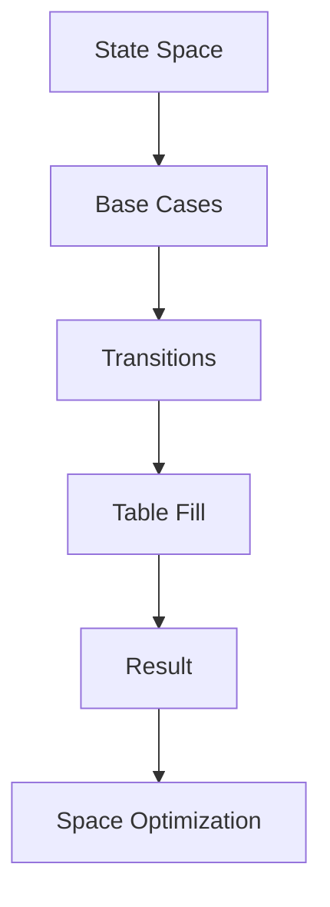
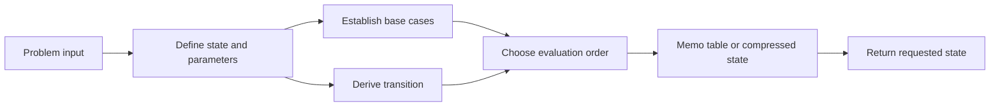

# Chapter 1: State Design and Transition Optimization

## Why This Matters

DP is often the most complex topic for SDE-2 interviews because it combines recurrence correctness with state-space control.

## Learning Objectives

- Define state meaning clearly (`dp[i]`, `dp[i][j]`, etc.).
- Write transitions from previously solved subproblems.
- Convert 2D DP to 1D when possible.
- Perform complexity analysis and identify redundant states.

## Core Concept

DP is recursion with memoization (top-down) or table filling (bottom-up).

A practical framework:

1. Define exact question state.
2. Enumerate transition options.
3. Choose base cases.
4. Compute in dependency order.
5. Return target state.

## Internal Working

## Architecture or Memory Diagram

The state definition determines what each cached value means. Base cases terminate the dependency graph, the transition identifies smaller solved states, and the evaluation order guarantees every dependency is available before it is consumed.

## Code Example

[Code Example 1 in detail (external file)](https://github.com/vinayreddykalluri/SDE2-Interview-Handbook/blob/master/examples/java/src/main/java/io/github/vinayreddykalluri/interviewhandbook/codingfoundations/dynamicprogramming/DpPatterns.java)

## Step-by-Step Execution

1. Base: one way for zero and one step.
2. For each `i`, transitions from `i-1` and `i-2`.
3. Use rolling variables to compress space.
4. Return total ways to reach top.

## Interviewer Perspective

Interviewers test if you can justify state definitions:
- "What does `dp[i]` represent?"
- "Why is this transition complete?"
- "How do you prove optimal substructure?"

## Common Mistakes

- Wrong state interpretation causing incorrect transitions.
- Missing base cases leading to underflow.
- Not distinguishing 0/1 indexing for items or dimensions.

## Production Perspective

DP principles mirror decision memoization in feature flags, resource planning, and game/optimization services.

## Must Know for DSA

Most hard interview tasks require mapping combinatorial structure to compact states and transitions.

## Interview Questions and Answers

- **Q: Why memoization then iterative?**
  - **Answer:** memoization is easier to reason; iterative avoids recursion overhead.
- **Q: How to optimize space?**
  - **Answer:** only keep needed previous rows/states.
- **Q: What is state explosion?**
  - **Answer:** high state dimensions beyond constraints can make DP infeasible.

## Practice Exercises

1. Implement 0/1 knapsack with 2D and 1D approaches.
2. Longest increasing subsequence with O(n log n) variation.
3. DP on intervals and explain transition bounds.

## Revision Checklist

- [ ] Define exact meaning of each DP dimension.
- [ ] Ensure transition covers all possibilities.
- [ ] Add and test base cases.
- [ ] Optimize state storage only after correctness is stable.

## One-Page Summary

DP is a structured optimization method: precise state definition and trusted transitions convert exponential search into polynomial-time planning.
