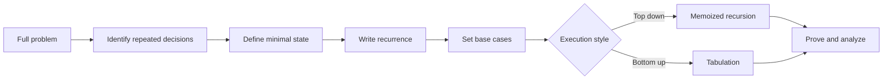

# Dynamic Programming: Interview Deep Dive

Dynamic programming is disciplined reuse of repeated subproblem results. The central skill is state design: define the smallest information that makes the future independent of the full history.

## Learning contract

After this chapter, you should be able to:

- recognize overlapping subproblems and optimal substructure;
- define state, transition, base cases, and evaluation order;
- derive memoized and tabulated versions from one recurrence;
- prove a transition by exhaustive final-choice reasoning;
- compress memory without overwriting needed dependencies;
- explain when greedy, graph search, or DP is the better model.

## 1. The five-part DP specification

Do not start with a table. Write these five statements first:

1. **State:** what does `dp[...]` mean?
2. **Choice:** what decisions are available from that state?
3. **Transition:** how does each choice reduce to smaller states?
4. **Base case:** which states have direct answers?
5. **Order:** when is every dependency available?



A valid state is sufficient: two histories mapped to the same state must have identical legal futures and future costs. A good state is also minimal: remove history that does not affect future decisions.

## 2. Recognition signals

DP is a strong candidate when:

- a brute-force decision tree revisits the same remaining problem;
- the answer asks for a minimum, maximum, count, feasibility, or number of ways;
- a prefix/suffix plus a small resource or status fully describes the future;
- local choices interact, so a simple greedy rule is not obviously safe.

DP is not automatically appropriate. If subproblems do not overlap, divide and conquer may be enough. If a local exchange argument proves a greedy choice safe, greedy may be simpler. If states and transitions form an unweighted shortest-path problem, BFS may express the solution more directly.

## 3. Worked example: house robber

Given nonnegative values, choose a maximum-sum subset with no adjacent indices.

### State

`dp[i]` is the maximum value obtainable from the first `i` houses, indices `0` through `i - 1`.

### Transition

For the last considered house `i - 1`, every valid optimum does exactly one of two things:

- skip it, giving `dp[i - 1]`;
- take it, forcing house `i - 2` to be skipped, giving `dp[i - 2] + value[i - 1]`.

Therefore:

```text
dp[i] = max(dp[i - 1], dp[i - 2] + value[i - 1])
dp[0] = 0
dp[1] = value[0]
```

### Trace for `[2, 7, 9, 3, 1]`

| `i` | Skip | Take | `dp[i]` |
|---:|---:|---:|---:|
| 1 | `0` | `2` | `2` |
| 2 | `2` | `7` | `7` |
| 3 | `7` | `2 + 9` | `11` |
| 4 | `11` | `7 + 3` | `11` |
| 5 | `11` | `11 + 1` | `12` |

### Space-compressed implementation

```java
static long maxNonAdjacent(int[] values) {
    long twoBack = 0;
    long oneBack = 0;

    for (int value : values) {
        long current = Math.max(oneBack, twoBack + value);
        twoBack = oneBack;
        oneBack = current;
    }
    return oneBack;
}
```

Time is `O(n)` and auxiliary space is `O(1)`. `long` protects the aggregate when input sums may exceed `int`.

## 4. Correctness proof template

A reusable proof has three parts:

1. **Exhaustiveness:** every feasible solution belongs to one transition case.
2. **Optimal substructure:** after fixing the current choice, the remaining part must be an optimal solution to the referenced subproblem; otherwise replace it with a better one.
3. **Induction/order:** all smaller dependency states are correct before the current state is evaluated.

For house robber, every optimum either includes the last house or does not. Those cases are disjoint and exhaustive, and each leaves a smaller prefix with the same problem definition.

## 5. Memoization versus tabulation

| Concern | Memoization | Tabulation |
|---|---|---|
| Direction | Demand-driven, top down | Dependency-driven, bottom up |
| Reachable states | Computes only reached states | Often computes the full table |
| Recursion depth | Present | Avoided |
| Order design | Encoded by calls | Must be explicit |
| Constant factors | Call and map/array overhead | Usually tighter loops |
| Reconstruction | Store choices/parents | Store choices/parents |

Derive the recurrence first. Memoization and tabulation are execution strategies for the same state graph.

## 6. State dimensions and complexity

DP time is usually:

```text
number of reachable states * transition work per state
```

For `dp[index][remainingCapacity]`, there are commonly `O(n * capacity)` states. This is pseudo-polynomial when capacity is a numeric value encoded in `log capacity` input bits.

Do not hide dimensions. If state includes index, transaction count, and holding status, state complexity is their product.

## 7. Safe space compression

Compress only after identifying which previous states the transition reads.

- If row `i` reads only row `i - 1`, two rows may suffice.
- If each cell reads left and above in the current table, one row may work with careful direction.
- For 0/1 knapsack, iterate capacity downward so an item is not reused in the same row.
- For unbounded knapsack, iterate capacity upward when reuse is allowed.

Loop direction is part of correctness because in-place updates change which logical row a read observes.

## 8. Interview questions and model answers

### Q1. How do you recognize a DP problem?

Start from a brute-force choice tree. If the same future problem appears from different histories and an optimal answer can be composed from optimal smaller answers, memoization or tabulation can remove repeated work.

### Q2. What makes a DP state correct?

It must contain all information that changes future legal choices or costs. If two histories share a state but have different futures, the state is missing a dimension. If a field never affects the future, it is redundant.

### Q3. DP or greedy: how do you decide?

Greedy commits to a local choice and needs a proof such as an exchange argument. DP retains multiple relevant states until comparison is safe. Failure to find a greedy proof is not itself proof that DP is required, but counterexamples often expose the need.

### Q4. What is the difference between memoization and tabulation complexity?

Both are bounded by states times transition work. Memoization may skip unreachable states but pays recursion and cache overhead. Tabulation may compute unnecessary states but offers explicit order and often lower constants.

### Q5. When is space compression unsafe?

When an in-place write overwrites a value still needed by a later transition, or when reconstruction requires discarded history. Draw dependency arrows and choose update order before compressing.

### Q6. How do you reconstruct the chosen solution?

Store a parent or choice for each state, or compare neighboring table values while walking backward. The optimal score alone is insufficient if the API must return the actual items, path, or edits.

## 9. Common failure modes

- defining state vaguely as "best answer so far";
- omitting a dimension that affects future choices;
- initializing unreachable states as valid zero-cost states;
- iterating in an order that reads current-row updates accidentally;
- reporting table size but ignoring transition-loop cost;
- compressing space before correctness is established;
- using `int` when counts or sums can overflow.

## 10. Practice ladder

1. Climbing stairs and house robber: one-dimensional recurrence.
2. Minimum coin change: unreachable-state handling.
3. 0/1 and unbounded knapsack: understand loop direction.
4. Longest common subsequence: two-dimensional prefix state.
5. Edit distance: reconstruct operations as well as cost.
6. Stock transactions: design state from index, holdings, and remaining actions.

## Runnable reference

See [`DpPatterns.java`](https://github.com/vinayreddykalluri/SDE2-Interview-Handbook/blob/master/examples/java/src/main/java/io/github/vinayreddykalluri/interviewhandbook/codingfoundations/dynamicprogramming/DpPatterns.java) for executable dynamic-programming patterns.

## 60-second revision

- Define state meaning before creating a table.
- Write choices, transition, base cases, and dependency order.
- Complexity is states times work per state.
- Memoization and tabulation execute the same recurrence differently.
- Prove transitions by exhaustive final choices and optimal substructure.
- Compress memory only after analyzing dependency direction.

