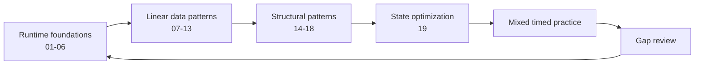

# Coding Foundations

Use this track to rebuild the mechanics that support backend coding interviews. The order is intentional: establish runtime and reasoning fundamentals, master linear patterns, then move into recursive structures and state optimization.

## Track Roadmap

## Recommended Sequence

| Stage | Modules | Interview capability |
|---|---|---|
| Runtime foundations | 01-06 | Explain Java execution, analyze cost, control boundaries, and use arithmetic and bits safely |
| Linear data patterns | 07-13 | Recognize array, string, hashing, window, pointer, prefix, and binary-search invariants |
| Structural patterns | 14-18 | Model nested state, worklists, pointer structures, trees, and graphs |
| State optimization | 19 | Derive dynamic-programming state, transitions, evaluation order, and memory reduction |

## Modules

1. [Java runtime and language foundations](01-java-runtime/index.md)
2. [Time and space complexity](02-complexity/index.md)
3. [Math foundations](03-math/index.md)
4. [Loop reasoning](04-loop-reasoning/index.md)
5. [Boundary-safe indexing](05-indexing/index.md)
6. [Bit manipulation](06-bit-manipulation/index.md)
7. [Arrays](07-arrays/index.md)
8. [Strings](08-strings/index.md)
9. [Hashing](09-hashing/index.md)
10. [Sliding window](10-sliding-window/index.md)
11. [Two pointers](11-two-pointers/index.md)
12. [Prefix sums and difference arrays](12-prefix-sum/index.md)
13. [Binary search](13-binary-search/index.md)
14. [Stacks and recursion](14-stacks-recursion/index.md)
15. [Queues and deques](15-queues-deques/index.md)
16. [Linked lists](16-linked-lists/index.md)
17. [Trees](17-trees/index.md)
18. [Graphs](18-graphs/index.md)
19. [Dynamic programming](19-dynamic-programming/index.md)

## Repeatable Study Loop

1. Read the module overview and state its core invariant in your own words.
2. Trace the diagram and one worked example without running code.
3. Implement the linked Java example from an empty file.
4. Test normal, boundary, empty, duplicate, overflow, and adversarial cases.
5. Explain correctness and complexity aloud.
6. Record the first point where reasoning became uncertain.
7. Revisit that gap after one day and again after one week.

For interview-level integration, continue with [Programming Problem Solving](../backend-interview/01-programming-problem-solving/index.md).

