# Project Architecture

The handbook is a content product with multiple renderers. Markdown and runnable Java are authoritative sources; the portal, searchable handbook, and printable books are delivery formats built from those sources.

## Source-to-Output Flow

```mermaid
flowchart LR
    Docs["docs/<br/>Canonical prose and diagrams"]
    Code["examples/<br/>Runnable reference code"]
    Portal["web/<br/>Portal shell and learning metadata"]
    Theme["overrides/<br/>MkDocs presentation"]
    Templates["templates/<br/>Print presentation"]
    Scripts["scripts/<br/>Build and validation"]
    Docs --> Scripts
    Code --> Scripts
    Portal --> Scripts
    Theme --> Scripts
    Templates --> Scripts
    Scripts --> Site["site/<br/>Local portal plus /docs"]
    Scripts --> Books["output/<br/>PDF and DOCX"]
    Scripts --> Reports["Local validation results"]
```

Generated outputs are disposable. A contributor should be able to remove `site/` and `output/` and reproduce them from tracked sources.

## Layer Responsibilities

| Layer | Owns | Must not own |
|---|---|---|
| `docs/` | Educational narrative, Mermaid diagrams, navigation targets, revision material | Compiled classes or copied portal assets |
| `examples/` | Runnable implementations and tests | Long-form curriculum prose |
| `web/` | Portal shell, responsive UX, search/filter metadata | Duplicate handbook chapters |
| `overrides/` | Shared MkDocs page chrome and theme behavior | Curriculum content |
| `scripts/` | Deterministic build and validation orchestration | Hidden source data that cannot be reviewed |
| `templates/` | PDF/DOCX presentation inputs | Generated books |
| `.github/` | Community intake, ownership, dependency policy, disabled automation definitions | Product source files |

## Curriculum Boundaries

`docs/backend-interview/` is the primary interview track. It organizes material around hiring signals such as problem solving, object modeling, system design, data, reliability, security, and leadership.

`docs/coding-foundations/` is the concept track. It organizes Java and algorithm mechanics in a stable numbered sequence.

`examples/java/.../problemsolving/` contains code for the backend problem-solving track. `examples/java/.../codingfoundations/<topic>/` contains code for each coding-foundation module. Metadata in `web/content/coding-foundations.json` connects a documentation module to its semantic Java package.

## Local Delivery Pipeline

1. Authors change canonical Markdown, Java, portal assets, or build configuration.
2. `make validate` checks layout, navigation, links, Java compilation and execution, portal metadata, assets, and JavaScript syntax.
3. `make build-site` assembles the portal at `site/` and MkDocs under `site/docs/`.
4. `make build-pdf` and `make build-docx` create printable files under `output/`.
5. `vercel.json` can publish the same `site/` artifact as a Vercel preview.
6. Contributors inspect local or preview outputs before proposing a change.

GitHub workflow definitions are retained under `.github/workflows-disabled/` but are not executed. They move back to `.github/workflows/` only after explicit approval of the local product.

Vercel is independent of GitHub Actions: it installs `requirements-web.txt`, runs the existing site builder, normalizes deployment URLs, and serves only `site/`.

## Design Constraints

- Paths use lowercase kebab-case; ordered curriculum directories start with a two-digit sequence.
- Runnable Java packages use semantic lowercase names rather than presentation labels.
- Links must work under a GitHub project subpath and from the local portal.
- Theme changes must preserve readable diagrams and code in light and dark modes.
- Generated output, caches, and environments are never committed.
- Root community files remain at the root because GitHub discovers them there.

See [Repository Structure](repository-structure.md) for change-routing and naming rules.
