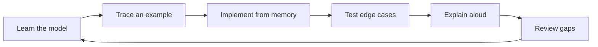

# Getting Started

The handbook supports three complementary workflows: guided reading, code practice, and printable revision.

## Fastest route for readers

1. Open the [Study Plan](study-plan.md).
2. Start with the overview page for your target volume.
3. Read the numbered chapter and redraw its main diagram from memory.
4. Open the linked Java source and identify its invariant, boundary conditions, and complexity.
5. Reimplement the example without looking.
6. Answer the interview questions aloud.
7. Finish with the revision checklist and one-page summary.

## Use the code library

Java implementations are maintained outside the documentation source so they can be compiled and tested independently.

1. Open the [Code Library](examples/README.md).
2. Choose the module and pattern.
3. Read the assumptions before the implementation.
4. Trace at least one normal case and one edge case.
5. Change the input and predict the result before running it.

For local compilation, see the repository's `examples/java/README.md`.

## Run the website locally

Prerequisites are Python 3.11 or newer and GNU Make.

```bash
git clone https://github.com/vinayreddykalluri/SDE2-Interview-Handbook.git
cd SDE2-Interview-Handbook
python -m venv .venv
source .venv/bin/activate
make install
make serve
```

Open `http://127.0.0.1:8000`. Search, navigation, syntax highlighting, Mermaid diagrams, and print styles work in the local site.

## Validate a contribution

```bash
make validate
make build-site
```

`make validate` checks chapter structure, navigation, links, Mermaid fences, Java compilation, and behavior smoke tests.

## Build printable books

Install Pandoc and XeLaTeX, then run:

```bash
make build-pdf
make build-docx
```

Expected combined outputs:

- `output/combined/SDE2-Interview-Handbook.pdf`
- `output/combined/SDE2-Interview-Handbook.docx`

individual module books are written to `output/pdf/` and `output/docx/`. Remote artifacts are intentionally unavailable while GitHub Actions remain disabled; build and inspect the books locally.

## Recommended interview loop



Do not optimize for page completion. Optimize for being able to derive the solution, defend the trade-offs, and write correct code under time pressure.
