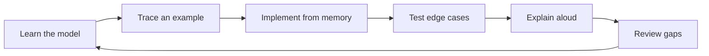

# Getting Started

The project has one curriculum presented through four connected surfaces. The global navigation uses the same names everywhere, so changing depth does not change the learning order.

| What you need | Open | Use it for |
|---|---|---|
| a complete explanation | <a href="../../books/">Books</a> | canonical chapters, diagrams, exercises, solutions, code indexes, and PDF downloads |
| an ordered preparation sequence | <a href="../../#journey">Study path</a> | deciding what to study next and tracking readiness |
| a concise lookup surface | [Handbook](index.md) | search, focused reference, and quick revision |
| timed interview work | [Practice](backend-interview/10-practice/index.md) | question banks, scoring rubrics, review logs, and reassessment |

## Fastest route for readers

1. If Java basics are not dependable, open the <a href="../../books/03-java-foundations-for-problem-solving/">Java Foundations book</a>.
2. Otherwise, use the <a href="../../#journey">Study path</a> to locate your next gap.
3. Read the numbered chapter and redraw its main diagram from memory.
4. Open the linked Java source and identify its invariant, boundary conditions, and complexity.
5. Reimplement the example without looking.
6. Answer the interview questions aloud.
7. Finish with the revision checklist and one-page summary.

## Use the code library

Java implementations are maintained outside the documentation source so they can be compiled and tested independently.

1. Open the [Code Library](examples/README.md).
2. Choose the module and pattern.
3. Read the assumptions before the implementation.
4. Trace at least one normal case and one edge case.
5. Change the input and predict the result before running it.

For local compilation, see the repository's `examples/java/README.md`.

## Run the website locally

Prerequisites are Python 3.11 or newer and GNU Make.

```bash
git clone https://github.com/vinayreddykalluri/SDE2-Interview-Handbook.git
cd SDE2-Interview-Handbook
python -m venv .venv
source .venv/bin/activate
make install
make serve-web
```

Open `http://127.0.0.1:8000`. The complete book library is under `/books/`, and the concise handbook is under `/docs/`. Search, navigation, syntax highlighting, Mermaid diagrams, and print styles work in the local site.

## Validate a contribution

```bash
make validate
make build-site
```

`make validate` checks chapter structure, navigation, links, Mermaid fences, Java compilation, and behavior smoke tests.

## Build printable books

Install Pandoc and XeLaTeX, then run:

```bash
make build-pdf
make build-docx
```

Expected combined outputs:

- `output/combined/SDE2-Interview-Handbook.pdf`
- `output/combined/SDE2-Interview-Handbook.docx`

Individual website-derived module books are written to `output/pdf/` and `output/docx/`. Build and inspect those outputs locally when changing handbook Markdown.

The publication-ready Java and DSA series is separate from those website-derived builds. Download its 30 reviewed PDFs from the [latest release](https://github.com/vinayreddykalluri/SDE2-Interview-Handbook/releases/latest), or browse the canonical files under `books/java-sde2-interview-preparation-series/dist/`.

## Recommended interview loop


```mermaid
flowchart LR
    Learn["Learn the model"] --> Trace["Trace an example"]
    Trace --> Implement["Implement from memory"]
    Implement --> Test["Test edge cases"]
    Test --> Explain["Explain aloud"]
    Explain --> Review["Review gaps"]
    Review --> Learn
```

Do not optimize for page completion. Optimize for being able to derive the solution, defend the trade-offs, and write correct code under time pressure.
