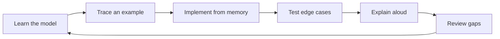

# Choose a Learning Segment

The project has three focused curriculum segments—Java Engineering, Data Structures and Algorithms, and System Design and Backend—presented in two formats: complete web books for active learning and matching PDFs for offline study. The topic reference and practice pages support those segments; they do not create competing routes.

| What you need | Use | What to do |
|---|---|---|
| active learning | <a href="../../books/">Web learning library</a> | choose a segment, then follow its numbered books, run examples, complete exercises, and open solutions |
| offline reading or revision | PDF link inside the current web book | annotate or review the same content without changing sequence |
| a quick clarification | [Topic reference](index.md) | look up the concept, then return to the current book |
| evidence of readiness | [Practice](backend-interview/10-practice/index.md) | run a timed prompt after completing the relevant material |

## Fastest route for readers

1. Choose Java, DSA, or System Design and Backend from the <a href="../../books/">learning library</a>.
2. Start with Book 01 in that segment unless its readiness checks are already dependable.
3. Read the numbered chapter and redraw its main diagram from memory.
4. Open the linked Java source and identify its invariant, boundary conditions, and complexity.
5. Reimplement the example without looking.
6. Answer the interview questions aloud.
7. Finish with the revision checklist and one-page summary.

## Use the code library

Java implementations are maintained outside the documentation source so they can be compiled and tested independently.

1. Open the [Code Library](examples/README.md).
2. Choose the module and pattern.
3. Read the assumptions before the implementation.
4. Trace at least one normal case and one edge case.
5. Change the input and predict the result before running it.

For local compilation, see the repository's `examples/java/README.md`.

## Run the website locally

Prerequisites are Python 3.11 or newer and GNU Make.

```bash
git clone https://github.com/vinayreddykalluri/SDE2-Interview-Handbook.git
cd SDE2-Interview-Handbook
python -m venv .venv
source .venv/bin/activate
make install
make serve-web
```

Open `http://127.0.0.1:8000`. The segmented web library is under `/books/`, and its supporting topic reference is under `/docs/`. Search, navigation, syntax highlighting, Mermaid diagrams, and print styles work in the local site.

## Validate a contribution

```bash
make validate
make build-site
```

`make validate` checks chapter structure, navigation, links, Mermaid fences, Java compilation, and behavior smoke tests.

## Build printable books

Install Pandoc and XeLaTeX, then run:

```bash
make build-pdf
make build-docx
```

Expected combined outputs:

- `output/combined/SDE2-Interview-Handbook.pdf`
- `output/combined/SDE2-Interview-Handbook.docx`

Individual website-derived module books are written to `output/pdf/` and `output/docx/`. Build and inspect those outputs locally when changing handbook Markdown.

The publication-ready book library is separate from those website-derived builds. Download its 42 PDFs from the [latest release](https://github.com/vinayreddykalluri/SDE2-Interview-Handbook/releases/latest), or browse the canonical files under `books/java-sde2-interview-preparation-series/dist/`.

## Recommended interview loop


```mermaid
flowchart LR
    Learn["Learn the model"] --> Trace["Trace an example"]
    Trace --> Implement["Implement from memory"]
    Implement --> Test["Test edge cases"]
    Test --> Explain["Explain aloud"]
    Explain --> Review["Review gaps"]
    Review --> Learn
```

Do not optimize for page completion. Optimize for being able to derive the solution, defend the trade-offs, and write correct code under time pressure.
