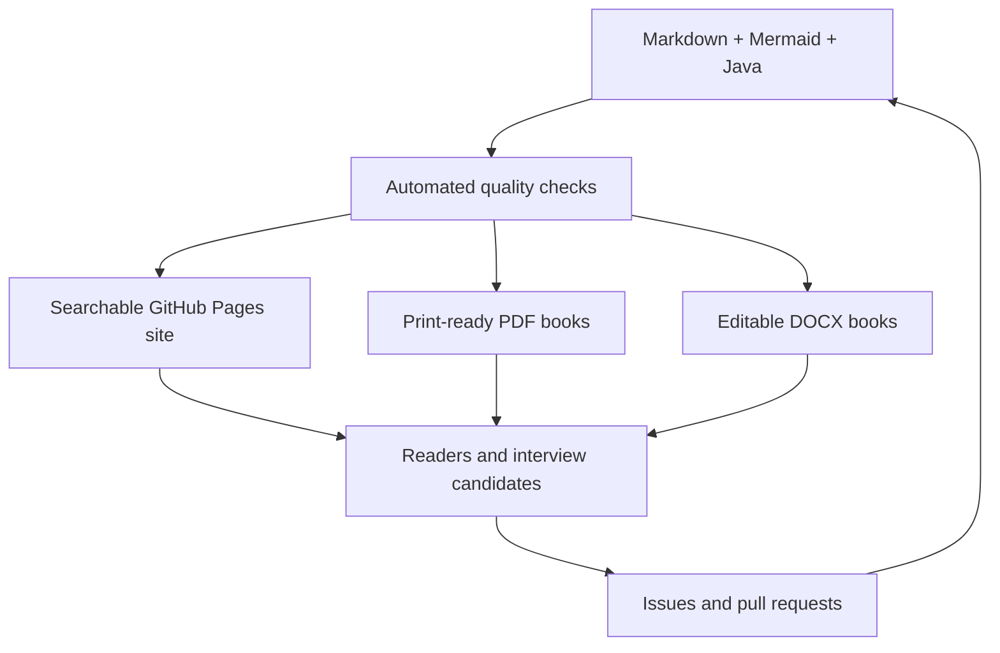

# SDE2 Interview Handbook

The SDE2 Interview Handbook is an open-source learning system for engineers who need more than memorized interview patterns. It connects Java and JVM internals, algorithm invariants, production trade-offs, communication strategy, and deliberate practice.

[Start the guided study path](getting-started.md){ .md-button .md-button--primary }
[Browse runnable Java](examples/README.md){ .md-button }

## Choose your path

| If you need to... | Start here |
| --- | --- |
| rebuild Java and JVM fundamentals | Module 01, then Modules 02-06 |
| prepare for array and string rounds | Modules 07-13 |
| master traversal and state problems | Modules 14-19 |
| revise in a limited time | the study plan and each chapter's one-page summary |
| inspect or run implementations | the separate code library |
| print or annotate offline | Downloads and Printing |

## The complete learning sequence

| Stage | Modules | Outcome |
| --- | --- | --- |
| Runtime foundations | 01-06 | Explain Java execution, complexity, indexing, loops, math, and bits from first principles |
| Linear-data patterns | 07-13 | Recognize array, string, hashing, window, pointer, prefix, and binary-search invariants |
| Structural patterns | 14-18 | Model stacks, queues, linked lists, trees, and graphs with the right traversal state |
| Optimization | 19 | Design dynamic-programming state, transitions, base cases, and memory reductions |

## How a chapter works

Every numbered chapter includes a consistent set of sections: why the topic matters, learning objectives, internal working, diagrams, code, execution traces, interviewer expectations, common mistakes, production context, DSA relevance, questions, exercises, and a concise revision sheet.

## Quality promise

- Large Java implementations live separately from prose and are compiled automatically.
- Internal links, navigation, chapter structure, and Mermaid fences are validated.
- The website is rebuilt from committed Markdown on every publication.
- PDF and DOCX books are generated by automation, not manually maintained copies.
- Documentation and source are reusable under explicit open licenses.

## Project flow

This handbook is educational material, not a promise of interview outcomes. Use it to improve reasoning, implementation discipline, and the clarity of your technical explanations.
